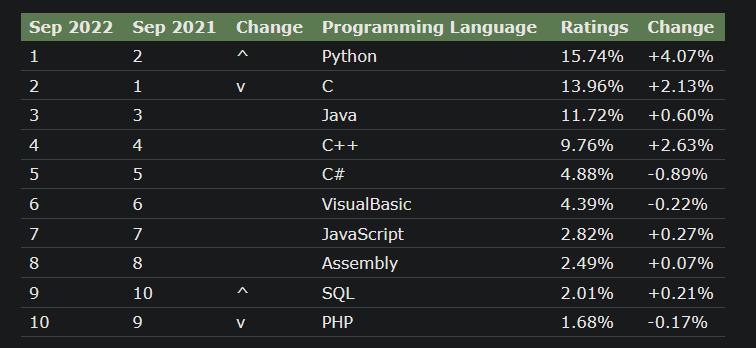
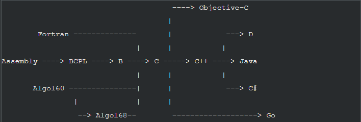
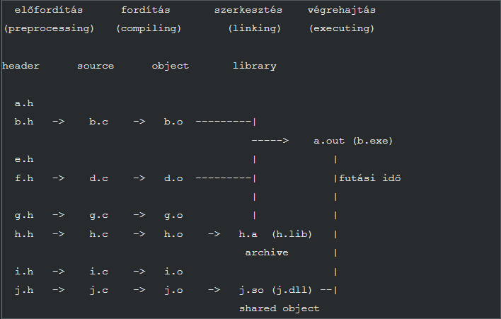

# Programozási alapfogalmak
## forrás: 
Az egész markdown fájl tartalma egy átirat itt a forrás: [Dr. Porkoláb Zoltán oldala](https://gsd.web.elte.hu/lectures/imper/imper-lecture-1/)

---

## Szintaxis (syntax)

A programozási nyelv helyes nyelvtana. Például: mik a helyes kulcsszavak, hogyan nézhet ki egy változó neve, hova tegyünk pontosvesszőt, stb.

- A PL/I programozási nyelv például legenerálta a hiányzó `end` utasításokat.
- Az Algol68 nyelvben az üres utasítás csak a `skip` utasítással valósult meg.
- Pascal-ban `else` előtt sohasem szabad `;`-nek szerepelnie, C-ben ez előfordulhat.
- Go-ban kötelező kiírni a nyitó-csukó kapcsos zárójeleket a vezérlési szerkezetek esetén, így elkerülhető a [goto-fail](https://www.blackduck.com/blog/understanding-apple-goto-fail-vulnerability-2.html) típusú hiba.
- A legtöbb nyelvben a whitespace-ek közönbösek, de pl. Python-ban a tabulálás is azonosítja a programszerkezetet.
- Az APL-ben mind a 256 karakter egy-egy érvényes operátor.

---

## Szemantika (semantics)

A szintaktikailag helyes programok jelentése. Például: milyen típusrendszere van a nyelvnek, milyen konverziók történnek, melyik függvényt hívjuk meg egy híváskor, stb.

- C++-ban az `int` és `bool` típusok között automatikus oda-vissza konverzió van.
- Más nyelvekben szigorúbb a típusosság.
- Egyes objektum-orientált nyelvekben a meghívott virtuális függvény kiválasztása az objektum dinamikus típusától függ (dynamic dispatch), ritkán több objektumtól is (multiple dispatch).
- A szemantikát különböző nyelvekben eltérően definiálják: Haskell-ben matematikai formulákkal (denotational semantics), Algol68-ban logikai kifejezésekkel (operational semantics), de létezik axiomatikus és szöveges megadás is.

> Egyes esetekben a szemantika nagyon bonyolult lehet. Mit jelent C++-ban a *protected abstract virtual base pure virtual private destructor*? [Példa](https://stackoverflow.com/questions/3618760/c-protected-abstract-virtual-base-pure-virtual-private-destructor).

---

## Pragmatika (pragmatics)

A nyelv konstrukcióinak használata. Például: hogyan használjuk az egyes nyelvi konstrukciókat a céljaink eléréséért, hogyan alakult a története, milyen fejlődési irányok léteznek.

- Ugyanazt a feladatot sokféleképpen is elvégezhetjük (pl. ciklus: `while`, `for`, `do-while`).
- Melyik a legjobb konstrukció? Melyik a legolvashatóbb, legkarbantarthatóbb, leghatékonyabb?
- Az informatika és a programozási nyelvek is folyamatosan fejlődnek.
- Példák: C malloc/free → C++ new/delete → smart pointerek (C++11-től).
- Python 2 és 3 között jelentős változások történtek, egyes programok eltérően működnek az új verzióban.

---

# Programozási paradigmák

A bonyolult informatikai feladatokat kisebb részekre bontjuk, amíg elég kicsik ahhoz, hogy vagy létezik már megoldás rá, vagy hatékonyan megoldjuk magunk. A felbontás elveit a programozási paradigma határozza meg.

## Imperatív programozás

Akkor beszélünk imperatív programokról, amikor explicit mi vezéreljük, hogy a program hogyan változtatja meg az állapotát.

### Procedurális programozás

- A feladatot alprogramokra (függvények, eljárások) bontjuk.
- Kommunikáció paraméterátadással, visszatérési értékkel.
- Hátrány: háttérbe szorulhatnak az adatszerkezetek.
- Példák: FORTRAN, Algol60, C, Go.

### Objektumelvű programozás

- A valós világ objektumait modellezzük, absztrakcióval osztályokat alkotunk.
- Az osztályok adatszerkezetén és a rajtuk értelmezett műveleteken van a hangsúly.
- Példák: Simula67, Smalltalk, Eiffel, Java, C#.

## Deklaratív programozás

Deklaráljuk a program elvárt működését, nem határozzuk meg explicit a végrehajtás mikéntjét.

### Funkcionális programozás

- Az eredmény egymást hívó, mellékhatás-mentes függvényekből áll.
- Nincs értékadás, minden memóriaterület egyszer kap értéket (referential transparency).
- Példák: Lisp, ML, Haskell, Clean.

### Logikai programozás

- A rendszer tényeit és következtetési szabályait adjuk meg.
- Példa: Prolog.

## Multiparadigma programozás

- Léteznek más paradigmák is: matematikai, generikus, szándékalapú stb.
- Egyes nyelvek több paradigmát is támogatnak (pl. C++: objektumelvű, procedurális, funkcionális, generikus).

---

# A C programozási nyelv

A procedurális programozás alapjait a C nyelv segítségével mutatjuk be. [Miért?](https://9gag.com/gag/azjxrKj)

A nyelvek népszerűsége a [TIOBE index](https://www.tiobe.com/tiobe-index/) szerint (2022 szeptember):



## A C nyelv és története

A C egy általános célú programozási nyelv, melyet Dennis Ritchie fejlesztett ki Ken Thompson segítségével 1969 és 1973 között a UNIX rendszerekre, az AT&T Bell Labs-nál. Idővel minden jelentős operációs rendszerre készült C fordító, és a legnépszerűbb nyelvek egyikévé vált. Rendszerprogramozáshoz és felhasználói programokhoz egyaránt jól használható.

A C minden idők legszélesebb körben használt programozási nyelve, fordítói elérhetők szinte minden számítógép-architektúrára és operációs rendszerre.  
[További információ](https://hu.wikipedia.org/wiki/C_(programoz%C3%A1si_nyelv))

A C helye a programozási nyelvek között:



[Programozási nyelvek hatása](https://exploring-data.com/vis/programming-languages-influence-network/)

## A C idővonala

- 1969: Ken Thompson kifejleszti a B nyelvet (egyszerűsített BCPL)
- 1969-: Ken Thompson, Dennis Ritchie és mások elkezdenek dolgozni a UNIX-on
- 1972: Dennis Ritchie kifejleszti a C nyelvet
- 1972-73: UNIX kernel-t újraírják C-ben
- 1977: Johnson Portable C Compiler-e
- 1978: Brian Kernighan és Dennis Ritchie: *The C Programming Language* könyve
- 1988: Második kiadás, az ANSI C leírása
- 1989: ANSI C standard (C90) (32 kulcsszó)
- 1999: ANSI C99 standard (+5 kulcsszó)
- 2011: ANSI C11 standard (+7 kulcsszó)

> Az órán döntően az 1989-es ANSI C-t használjuk.

---

# Fordítás, szerkesztés, végrehajtás

## Fordítás vagy interpretálás

A programozási nyelvek egy részét fordítóprogram tárgykóddá (object code) fordítja. A tárgykód már gépi kódú utasításokat tartalmaz, de lehetnek benne fel nem oldott hivatkozások (pl. globális változók, más függvények).

A hivatkozásokat a szerkesztő (linker) oldja fel, más tárgykódokból vagy könyvtárakból (library).  
A könyvtár szerkesztésre optimalizált tárgykódok halmaza, például a nyelv szabványos könyvtára (standard library).


A szerkesztés lehet:
- **Statikus**: a végrehajtható állományba belekerül a hivatkozott kód.
- **Dinamikus**: csak egy kis kódrészlet kerül be, a hivatkozott kód futásidőben töltődik be.


Kiterjesztések:
- Unix: tárgykód `.o`, statikus könyvtár `.a`, dinamikus könyvtár `.so`
- Windows: tárgykód `.obj`, statikus könyvtár `.LIB`, dinamikus könyvtár `.DLL`



Interpreteres nyelvek: az interpreter olvassa és lépésenként végrehajtja a forráskódot.  
Példa: Java közbülső kódra (bytecode) fordít, amit a JVM hajt végre.  
Léteznek hibrid megoldások is, pl. JIT (Just In Time compiler).

---

## Az első C program: hello world

```c
#include <stdio.h>
int main()
{
    printf("hello world\n");
    return 0;   
}
```

Fordítás és futtatás parancssoron:

```sh
# Fordítás és linkelés
$ gcc hello.c

# Futtatás
$ ./a.out

# Fordítás figyelmeztetésekkel
$ gcc -ansi -pedantic -Wall -Wextra hello.c

# C11 mód
$ gcc -std=c11 -ansi -pedantic -Wall -Wextra hello.c

# Kimeneti fájlnév megadása
$ gcc -std=c11 -ansi -pedantic -Wall -Wextra hello.c -o a.exe
```

**Külön lépésekben:**

```sh
# Csak fordítás (tárgykód)
$ gcc -c hello.c
$ ls
hello.o

# Linkelés
$ gcc hello.o

# Több forrás és tárgykód
$ gcc a.c b.c d.o e.a f.so
```

---

## Fordítási hibák, figyelmeztetések (warning-ok)

**Szinaktikus hiba:**

```c
/*
 * BAD VERSION !!!
 * Missing semicolon
 */
#include <stdio.h>
int main()
{
    printf("hello world\n") // missing ;
    return 0;
}
```

Fordító üzenete:
```
$ gcc -ansi -pedantic -W -Wall m.c 
m.c: In function ‘main’:
m.c:6:28: error: expected expression before ‘/’ token
     printf("hello world\n") // missing ;
```

**Figyelmeztetés (warning):**

```c
/*
 * BAD VERSION !!!
 * Missing header
 */
// #include <stdio.h>
int main()
{
    printf("hello world\n");
    return 0;
}
```

Fordító üzenete:
```
$ gcc -ansi -pedantic -W -Wall -std=c11 hello2.c -c
hello2.c: In function ‘main’:
hello2.c:6:3: warning: implicit declaration of function ‘printf’ [-Wimplicit-function-declaration]
     printf("hello world\n");
     ^
hello2.c:6:3: warning: incompatible implicit declaration of built-in function ‘printf’
```

> A figyelmeztetéseket komolyan kell venni, célszerű warning-free kódot írni.

Szerkesztési (linkelési) hibák is előfordulhatnak, ha például hiányzik egy függvény implementációja vagy többször szerepel.

---

# Ajánlott feladatok

1. Hozzon létre egy programot, ami kiírja a nevét. Fordítsa le, szerkessze, futtassa.
2. Vágja ketté az előző programot két forrásfájlra. Az egyik visszaadja a nevét, a másik kiírja. Tipp: a nevet visszaadó függvény szignatúrája legyen `char *my_name(void)`. A printf-ben használja a kiíráshoz a `%s` formátumot.


