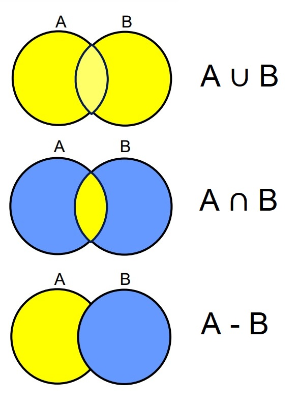
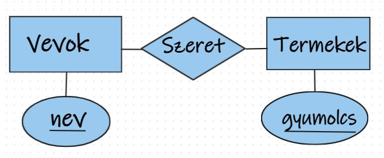

  1.GYAKORLAT (ADATBÁZISOK)    
       
    ÁLTALÁNOS INFORMÁCIÓ
    - Bemutatkozás, ismerkedés, "adatlap" (ki hol találkozott az SQL nyelvvel?) 
    - A tantárgyfelvételről információ (az előadást is fel kell venni) ea-tananyag
    - A félév célja, az előadások és a gyakorlatok tematikája,  tankönyv, példatár
    - A gyakorlati jegy megszerzésének feltételei, gyakorlati követelmények
   
   I.RÉSZ: RELÁCIÓS ADATMODELL BEVEZETÉS "HALMAZ-SZEMLÉLET"
   - 1.gyak. egy reláció = relációs séma + előfordulás (véges sok sor halmaza),
     reláció/tábla, séma, előfordulás, attribútum/oszlop, sor/rekord, véges halmaz. 
   
   - A relációs algebrához egy relax környezet táblákkal: dbis uibk github io/relax
   - A relációs algebrai műveletek eredménye halmaz, vagyis ez az implementáció
     minden művelet elvégzése után automatikusan megszünteti az ismétlődéseket. 
     A relációs algebrai fület használjuk, ez a szintaxis érzékeny a kis-nagybetűre,
     algebrában a szűrőfeltételben nem használható alkérdés (az csak SQL-ben).
   
   - Az első gyakorlaton csak ismerkedünk a környezettel és relációs adatmodellel.
  -  Relációs algebrai alapok: Kezdetek: Vetítés, kiválasztás és halmazműveletek
     Unér műveletek: pi-vetítés, sigma-kiválasztás, rho-átnevezés (táblák v. oszlopok)
     Halmazműveletek: unió (union), halmazműv.különbség (-), metszet (intersect)
     Binér műveletek: halmazműveletek, direkt szorzat (cross join), összekapcsolások,
     selfjoin (egy tábla önmagával vett direkt szorzata, ehhez rho-tábla átnevezése).
halmazmuveletek

--- Példa: Szeret (nev, gyumolcs) sémájú tábla létrehozása: Relax_Szeret.txt
    Szeret (nev, gyumolcs) tábla sok-sok kapcsolatot ír le, azaz egy vevő
    több gyümölcsöt is szerethet és egy gyümölcsöt több vevő is szerethet.
    
   
 
-- Rel.algebra: egy táblára vonatkozó lekérdezések, tábla átnevezése,
    halmazműveletek, egy tábla önmagával vett direkt szorzata (selfjoin).
    Az alap relációs algebrában nem használhatóak függvények, összesítések!
 1. Kik szeretik az almát? (HF: Milyen gyümölcsöket szeret 'Micimackó'?)
 2. Kik nem szeretik az almát? (de valami mást igen)
 3. Kik azok, akik szeretik az almát, de nem szeretik a körtét?
 4. Kik szeretik az almát vagy a körtét? (vagy mind a kettőt, "megengedő")
     (többféleképpen is megadhatjuk, hasonlítsuk össze a megoldásokat)
 5. Kik szeretik az almát is és a körtét is? (itt is nézzünk alternatív megoldást)
     (Hogyan tudunk sorpárokat összehasonlítani?) 
 6. Kik szeretik az almát vagy a körtét, de csak az egyiket? ("kizáró vagy")
 7. Kik szeretnek legalább kétféle gyümölcsöt? (direkt szorzattal)
 8. Kik szeretnek legalább háromféle gyümölcsöt?
 9. Kik szeretnek legfeljebb kétféle gyümölcsöt?
10. Kik szeretnek pontosan kétféle gyümölcsöt?  
 
-- Folyt.köv.: "minden" kifejezése (Kik szeretnek minden gyümölcsöt?)
   
   
   II.RÉSZ: TECHNIKAI KÉRDÉSEK Oracle adatbázisok elérése, sqldeveloper
   - Az 1.héten az a célunk, hogy előkészítsük az SQL gyakorláshoz a környezetet,
     megbeszéljük hogyan csatlakozzunk az ELTE szervereken az adatbázisokhoz.
   - ELTE-s ORACLE ADATBÁZIS szerverek elérése -->> adatbazis_eleres.html