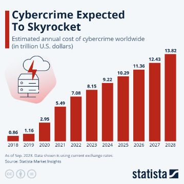
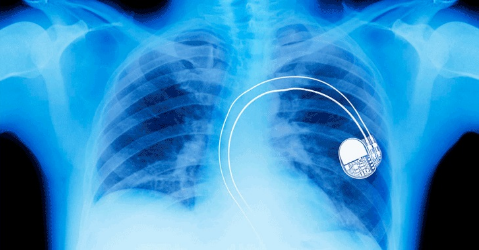
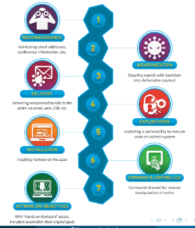
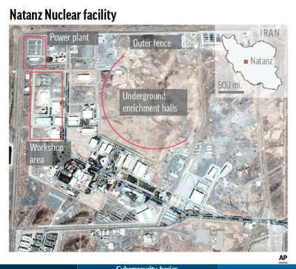
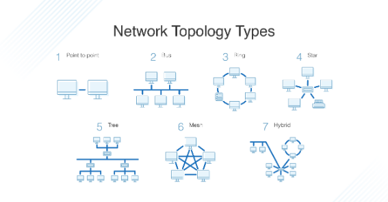
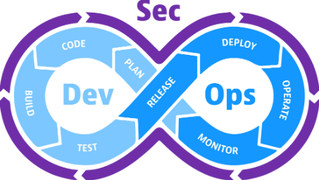

# Cybersecurity basics 

**Introduction** 
About this class and cybersecurity in general 

## This course 

- **Objective** 
Give overview of cybersecurity disciplines. No deep-dive, but covering most domains. 

- **Methodology** 
We are going to visit twelve different topics during the course of the semester. We will have several different lecturers so that each area is covered by someone with expertise in it. 

- **Offline/Online** 
Lectures will be in the classroom. Attending lectures is mandatory but will not be monitored. 

## Getting a grade 

- **Lecture only** 
This course is lecture only with no practice part. 

- **Semester** 
There are no mid-term deliverables or other assignments. 

- **Exam** 
There is a written exam at the end of the year. Your performance in the exam directly translates to your grade. 

## Warning 

- **Attendance and notes** 
Everything we discuss during classes can be part of the exam. Lecture slides will be made available but taking notes is recommended. 

- **Exam difficulty** 
This is not a free credit course. Following the course week by week, attending lectures and dedicating time to preparation for the exam is necessary to get a good grade. Statistically speaking, only 27% of students were able to pass the exam first try last year. 

## Cybersecurity - Why do we care? 

- **Digitalization** 
Civilization is quickly heading towards heavier and heavier digitalization every year.
- **Severe impact** 
There is a continuous increase in cyber attacks. 
- **Increasing scope** 
Twenty years ago cybersecurity was the problem of a small group in technology. Today it’s everybody’s problem. 

## Cybercrime damage 

## The Abbott Pacemaker incident 

##### [link](https://abbott.mediaroom.com/2017-08-29-Abbott-issues-new-updates-for-implanted-cardiac-devices) 

- **Official communication** 
_To further protect our patients, Abbott has developed new firmware with additional security measures that can be installed on our pacemakers._ 

- **Official communication** 
_There have been no reports of unauthorized access to any patient’s implanted device, and according to an advisory issued by the U.S. Department of Homeland Security, compromising the security of these devices would require a highly complex set of circumstances._ 

- **The internet of everything** 
In an age where everything is connected to the internet, cyber security is the security of everything. Literally a question of life and death. 

## So what are we going to talk about? 

## **List of Topics** 

- Terminology and Basics 
- Information Gathering 
- Social Engineering 
- Physical Security 
- Network Security 
- Web Application Security 
- Cryptographic Fundamentals 
- Password Management 
- Software Security 
- Mobile & Embedded Device Security 
- Malware & Anti-Virus 
- AI in Cybersecurity 

## Cyber Kill Chain by Lockheed Martin 

## Semester structure 

- We try to follow the same flow as the Cyber Kill Chain
- We establish the required vocabulary 
- We start from information gathering and progress through network security all the way to software security 
- We finish the semester by some recent developments due to the AI boom 
- We will keep the schedule flexible to accomodate guest lecturers 

## Week 1 - Terminology and Basics 

- We need to familiarize ourselves with the core concepts of cybersecurity so that we can efficiently discuss them in detail. 

- We will focus on core ideas such the CIA triad, vulnerabilities, CVEs and more. 

- Some basic cybersecurity regulatory ideas will also be discussed. 

## Week 2 - Information gathering 

- The very first item in the cyber kill chain is reconnaissance (borrowed from French), essentially meaning targeted information gathering. 

- We are going to look at what information can be collected on organizations or individuals. 

- Some methods to minimize exposure will be also discussed. 

## Week 2 - Information gathering - Relevance

## Week 2 - Information gathering - Relevance 

- In 2014 attackers used a series of information gathering techniques to first successfully identify Target’s HVAC vendor as an entry point. This small company had much weaker cybersecurity than Target. 
- The attackers then were able to use information gathering to obtain data of employees from social media sites of this smaller firm. 

## Week 3 - Social Engineering 

- Around 50% of all successful cyber attacks are still associated with at least one form of social engineering. 

- The most widespread social engineering methods today include phishing and scam calls but we will take a look at several other less popular but similarly dangerous methods. 
- We are going to discuss both the technical and the psychological aspects of social engineering techniques. 

## Week 3 - Social Engineering - Relevance 

- In 2014 attackers used a series of information gathering techniques to first successfully identify Target’s HVAC vendor as an entry point. This small company had much weaker cybersecurity than Target. 

- The attackers then were able to use information gathering to obtain data of employees from social media sites of this smaller firm.
- The acquired sensitive data was used to mount realistic phishing attacks which eventually succeeded and attackers gained access to the contractors’s systems containing credentials to Target’s network. 

## Week 4 - Physical Security 

- You can have all the best firewalls and antivirus if someone can walk into your server room and steal your drives or connect a device to your network. 

- We will talk about the relationship between physical and digital security.
- We will see how to secure digital assets with physical methods and what limitations and restrictions exist to do so. 

## Week 4 - Physical Security - Relevance 

- An infamous example of the importance of physical security controls is Stuxnet. 

- Stuxnet caused widespread physical damage to Natanz uranium enrichment plant in Iran.
- The worm was introduced to the otherwise air-gapped plant via a physical medium, most likely a USB drive. 

## Week 5 - Network Security 

- We are going to talk about the importance of securing network services. 
- We will also discuss network topology and segmentation strategies. 
- Cloud solutions are more and more important so will also discuss some core differences between on-premise networks and cloud options. 

## Week 5 - Network Security - Relevance 

- The attackers then were able to use information gathering to obtain data of employees from social media sites of this smaller firm. 

- The acquired sensitive data was used to mount realistic phishing attacks which eventually succeeded and attackers gained access to the contractors’s systems containing credentials to Target’s network. 
- Target’s network was not appropriately segmented and the access to the HVAC systems could be used to traverse to network segments POS terminals were connected to. 

## Week 6 - Web Application Security 

- We are going to talk about web technologies and the most typical attack types against them. 
- Web security is one of the most important aspects of cybersecurity since web applications are used by almost everyone now. 
- We will do a quick overview of the OWASP framework and OWASP top 10. 

## Week 6 - Web Application Security - Relevance 

- The 2017 Equifax breach was caused by an unpatched vulnerability in the Apache Struts web application framework, which attackers exploited to gain access to sensitive personal data, affecting 147 million individuals. 

- The breach occurred due to failure to apply timely security patches and lack of proper monitoring, which allowed attackers to move undetected through the network for several months. 
- The breach cost Equifax an estimated 1.4 billion dollars. 

## Week 7 - Cryptography Fundamentals 

- Cryptography is an essential tool of cybersecurity, with a long list of techniques for securing data. 

- We are going to introduce basic concepts related to encryption, hashing and digital signatures. 
- We will also see how these techniques are connected to topics we have already covered. 

## Week 7 - Cryptography Fundamentals - Relevance 

- Stuxnet caused widespread physical damage to Natanz uranium enrichment plant in Iran. 
- The worm was introduced to the otherwise air-gapped plant via a physical medium, most likely a USB drive. 
- Stuxnet was utilizing sophisticated encryption to hide its true nature and bypass detection mechanisms. 

## Week 8 - Password Management 

- The concept of passwords is several thousand years old, but the way we use them today is fundamentally different from how they were used in ancient times. 

- We will compare their classical use with their modern use and also see how passwords are handled in modern applications. 
- We will talk about password management best practices, some dos and dont’s. 

## Week 8 - Password Management - Relevance 

- In 2012 hackers gained access to LinkedIn’s user database and stole 6.5 million passwords. 

- The passwords were stored insecurely, making it easier for attackers to crack the passwords. 

- Since the passwords were not stored correctly, users with weaker passwords could be recovered. 

## Week 9 - Software Security 

- We are going to look at the security of software running on end user devices. 
- We will analyze techniques to assess software security as well as secure software design. 
- We are also going to look at DevSecOps and development practice evolution over time. 

## Week 9 - Software Security - Relevance

## Week 10 - Mobile & Embedded Device Security 

- Mobile and other hand-held devices are becoming more and more common. 
- Most security considerations are similar to personal computers but of course there are some differences, most notably they are prone to being stolen or lost and they have less computational capacity. 
- We will be discussing the differences in the security of mobile devices compared to personal computers. We will also talk a little bit about embedded security. 

## Week 10 - Mobile & Embedded Device Security - Relevance

- Pegasus is a sophisticated spyware developed by the Israeli cyberarms firm NSO Group. 

- In 2021, journalists from several media outlets revealed that Pegasus spyware was used to target over 50,000 individuals accross multiple countries. 

- Once installed, Pegasus is capable of accessing messages, emails, photos, and microphone and camera controls, enabling the spyware to monitor the target’s communications and activities without their knowledge. 

## Week 11 - Malware & Anti-Virus 

- We will discuss different categories of malicious software and their different capabilities. 

- We are going to look at the chapters of the endless back and forth between malware authors and antivirus vendors. 

- We will see how advancements in technology changed how we approach malware detection. 

## Week 11 - Malware & Anti-Virus - Relevance 

- In 2005 the Sasser worm targeted a vulnerability in Microsoft Windows that allowed it to spread without any user interaction. 

- Once a system was infected, the worm would scan the internet for other vulnerable systems and propagate itself across the network. It caused systems to crash and reboot repeatedly, disrupting normal operations. 

- The worm infected millions of computers worldwide, including at major organizations like Deutsche Bank and British Airways, which faced service disruptions. However, those who had up-to-date antivirus software in place were able to avoid much of the damage caused by the attack. 

## Week 12 - AI in Cybersecurity 

- We will look at how AI can be used both in defensive and offensive cyber operations. 
- We will discuss predictions due to the AI boom and how this technological advancement is expected to disrupt the security industry. 
- We will take a look at how AI can be used in monitoring and other use cases. 