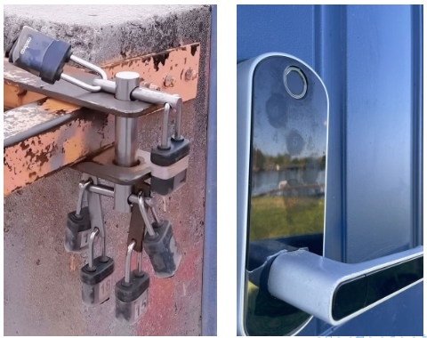
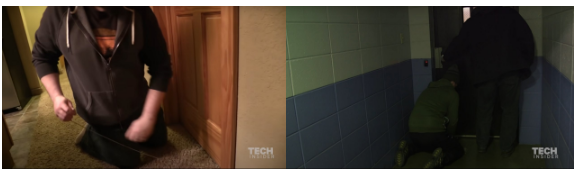
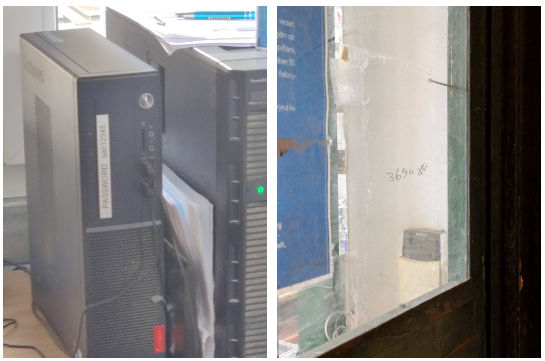
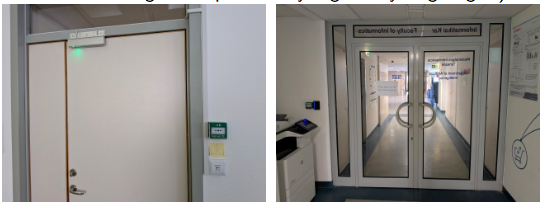

# **Cybersecurity Basics**

**The Art and Science of Physical Security**  
A Brief Introduction  

## **What is physical security?**

## **What is physical security?**

## **What is physical security?**

The term physical security can have quite different meanings in different scenarios. In general consideration this is a very broad topic. Here we focus our attention to the following aspect:

* **Definition: physical security / physsec**  
  Getting/preventing access to the target's IT infrastructure.

The duality of getting and preventing access is a core concept to (cyber)security and it is mirrored in how security professionals operate: the blue team tries to safeguard the system while the red team tries to breach these preventive measures. This approach is especially helpful in complex environments by guiding our efforts and putting us into the right mindset.

## **Ethical and legal considerations**

Physical penetration testing when done illegally is called break-in or burglary, or the very least trespassing. These are crimes and can result in serious punishment, including jail time. What makes physical or any other penetration testing legal and therefore ethical is the express permission of the target entity: the owner of the building, the manager, the CSO etc. someone with full legal responsibility. Permission should always be given in writing and this letter should be kept on person during the operation.

* **Attention**  
  Do not attempt physical or any other penetration testing on targets you do not own, except with express permission by the owner.

## **Physical security**

**What you will learn...**

* What are the layers of physical security?  
* Why do we even need physical pentesting?  
* What are the steps of pentesting?  
* How can we breach security?  
* How can we mitigate break-in?

## **What is the most basic physical security device?**

## **How far can we go with intuition?**

* **Grok**  
* Physsec is intuitive at first. \-\> This can lead to overconfidence. Overconfidence is always an opportunity for exploitation.  
* It gets very complex very fast when organizations grow.

## **Security as a strategy**

* When we assess the cybersecurity of a target, we cannot handle the different aspects of security completely separately. Intruders will look for any opportunity and gaps between security departments are obvious starting points for hackers. Good physsec plugs into a holistic approach to security: we need to have a complex strategy.  
* Low to medium value targets might be only interested in checking their network security, ie. penetration testing.  
* High value targets however have to count in physical threats and opt for red teaming ("a pentester only needs a laptop, a red team needs a lot of tools").  
* Sometimes the network is so well guarded that you need to gain physical access for digital exploitation.

## **Physical-digital entanglement**

* In big organizations physsec devices are increasingly network-attached: cameras, doors, motion sensors, open/close sensors...  
* This is a new (big) attack surface \-\> now we need to install security patches for the windows (not just Windows)???  
* Just think about it: an IP camera is a network device, therefore it is prone to network attacks (MITM, DoS...)\!

## **Layers of physsec**

* **Access control:** Ensuring only authorized access to the secured area.  
* **Surveillence:** Live and/or recorded monitoring of the secured area.  
  * Recording and logging helps with breach containment.  
* **Alarms**  
  * Helps timely countermeasures.  
  * But, ironically, can introduce new attack surfaces: A false positive fire alarm can be used as distraction \-\> great way of bypassing all the security: story time (Warszaw Stock Exchange)

## **Jumping to action**

## **Steps of a methodical physical penetration**

1. Reconnaissance  
2. Social engineering  
3. Break-in  
4. Exploitation  
5. Getting out ("break-out")  
6. Cash out

## **Reconnaissance**

## **Recon: OSINT**

First of all, we need to gather publicly available information about the target. We have to get as much info beforehand as possible. This is the easy part, be thorough\! We start this off-site, on-line: we gather OSINT (open source intelligence):

* Maps (Google Maps, Open Street Map etc.)  
* Satellite images  
* Street View  
* We check key target employees on social media, search engines.

## **Recon: Fieldwork**

Now we have to get on ground and gather even more info.

* Can you get trivial access? If the target is in a shared space (office/server room), you can get legitimate access to get closer.  
* A simple walk in the area.  
* Taking photos (telephoto lens is a great asset). Helps in reproducing similar badges...  
* Drone footage.  
* Longer surveillance: getting a hold of the daily routine. This might be critical in blending in.  
* Spy devices  
  * (hidden) cameras  
  * microphones/dictaphones  
  * laser microphones  
  * trackers: GPS/GNSS, Bluetooth tags  
* SIGINT (signals intelligence): We can try to gain access to wireless networks remotely. Yagi antennae or a "cantenna" can provide good signal-to-noise ratio from quite far away.

## **Laser microphones**

* Laser beam bounces off window pane, measures tiny vibrations caused by speaking inside the room.  
* Based on visible countermeasures, this is a real threat.  
* Countermeasure: extra window "shield" outside.  
* Bad news (for blue team): A simple video camera can be just as effective.

## **Social engineering**

**Elevator Technician is a Great Cover Story**

* Gathering even more, deeper information.  
* Planting disinformation to help with break-in.  
* Planting malicious devices like USB drives with malware \-\> US CENTCOM breach in 2008

## **Breaking in**

## **Methods of breaking in**

* Doors are often not even locked. \-\> Try to simply open it.  
* Tailgating: acting like you belong there  
* Piggybacking: you obviously don't belong there but seem legitimate like a delivery guy  
* Pickpocketing  
* Card bumping/skimming: physical credential cloning of RFID/NFC cards \-\> Flipper Zero or a bigger proxy scanner  
* Infiltration: getting in as a new hire/intern ("Jeremy from marketing" is a hacker? : )  
* Thick wool blankets work for barbed wires.  
* PIR (passive infrared) motion sensor detects body heat. Space blanket hides it.  
* Lockpicking \-\> Last resort, you should always try bypassing first.  
* Under door tool (wire or "loop on a stick") \-\> Opens the door from the inside.

## **Under door tool**

## **Methods of breaking in**

* Bad door fitment is very common \-\> Very easy access with latch tool (latch hook), no picking needed.  
* Sometimes removing hinges is possible from the outside.  
* REX (Request to Exit): auth in but no auth out. \-\> Usually a simple PIR (passive infrared) movement sensor. \-\> Can be tripped with vapor cloud.  
* Key boxes for telcos, fire department etc. \-\> combination locks, pickable, brute-forceable. Telco antenna maintenance and elevator maintenance are good cover stories.  
* Common keys can let you in many places.

## **Tripping a PIR sensor with vapor cloud / Common keys**

## **Exploitation**

* Reading passwords in plain sight.  
* Hotplug attack: Rubber Ducky (keystroke injection attack).  
* Installing a keylogger device.  
* Leaving malicious USB drives/devices around.  
* Network implants \-\> remote access granted.  
* Stealing (unencrypted) data/devices.  
* Gaining unauthorized access  
  * Ross Ulbricht arrest/laptop case  
  * Sim swapper kids: remo attack against crypto holder T-Mobile customers (remo: remote tablet)

## **Password/PIN in plain sight**

## **Getting out**

## **REX / No REX**

No REX? Might be a problem if you got in by tailgating. :')

## **Cash out**

**The main difference**  
This is where the ethical and unethical ways deviate. We write a report and an invoice, the bad guys (try to) get away with the loot. As ethical hackers, we ultimately work to make systems more resilient. The report has to be thorough, detailed about what security measures worked well and where we found weaknesses. Then we respectfully propose possible solutions to these shortcomings to the Blue Team.

## **Mitigation techniques for the Blue Team**

## **Mitigation**

* Separate physsec network from normal network. VLAN, firewalls, physically different network.  
* Monitor the network for anomalous activity.  
* No wireless wherever possible.  
* Firmware updates\!  
* Can't completely separate IT and facility management. \-\> Everybody has to understand the importance of a holistic security approach.  
* Only put on the Internet what needs to be there (eg. remote monitoring).  
* Don't keep security perimeter doors open (no Hodor\!).  
* Be aware of tailgating/piggybacking and challenge everyone you don't recognize. \-\> Situational awareness, vigilance, good security posture.  
* In high security areas make them scan their own badges even if you know them. Could be fired the day before.

## **Mitigation**

* Cooperate with guards.  
* Obvious one: use upgraded security devices everywhere possible: doors, hinges, latches, locks.  
* Intrusion detection systems.  
* Hybrid PIR/microwave REX sensors.  
* Skimming: RFID blocking wallet/bag.  
* Bluetooth tags: AirGuard.  
* Continuous re-evaluation of attack vectors and surfaces. \-\> These might change over time\!  
* 3rd party audits  
* Look out for insider threats\!

## **Additional Sources**

* Deviant Ollam's lecture: I'll let myself in  
* The Overlooked Side of Cybersecurity: Physical Security & Lockpicking  
* A different approach to physsec by Mental Outlaw  
* Google Streetview  
* Personal collection