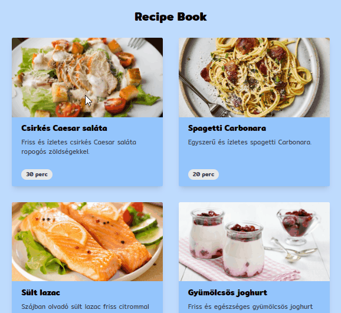
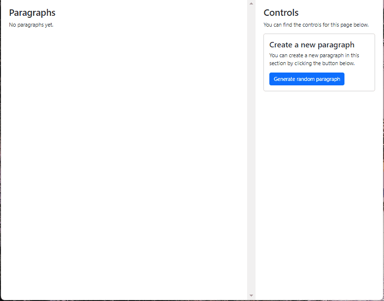
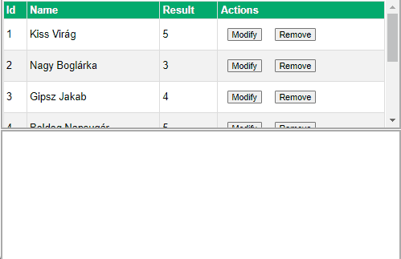
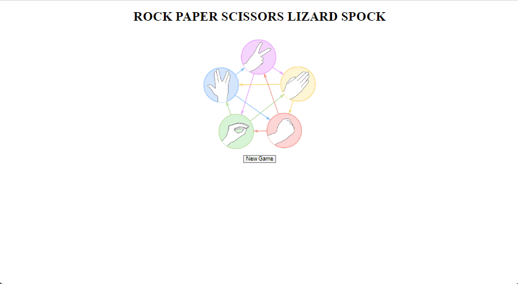

# Tudnivalók

- A zárthelyi megoldására **180 perc** áll rendelkezésre. **További 30 perc**et adunk a `README.md` fájl kitöltésére, a feladatok elolvasására, a szükséges telepítésekre, az anyagok letöltésére, összecsomagolására és feltöltésére.

- A feladatokat a Canvas rendszeren keresztül kell beadni. **A rendszer pontban 18:30-kor lezár, ezután nincs lehetőség beadásra**.

- A feladatok megoldásához **bármilyen segédanyag használható** (dokumentáció, előadás, órai anyag, cheat sheet). A zh időtartamában igénybe vett **emberi és mesterséges intelligencia segítség tilos** (szinkron, aszinkron, chat, fórum, ChatGPT, Copilot, stb)! Erről nyilatkoztok az alább olvasható `README.md` fájlban is, ahol tudomásul veszitek ennek következményeit.

- A feladatok nem épülnek egymásra, **tetszőleges sorrendben** megoldhatók.

## Előkészületek

1. [Töltsd le a keretprogramot! ](???)
2. Az egyes feladatok könyvtárában telepíteni kell a függőségeket egyesével. Ahol `server` és `client` könyvtár van, ott ezt külön meg kell tenni.

    ```cmd
    # Telepítés
    cd <feladat_könyvtára>
    npm install

    # Futtatás
    npm run dev
    ```

3. Töltsd ki a `README.md` fájl nyilatkozatában a nevedet és a Neptun azonosítódat! **A megfelelően kitöltött `README.md` fájl nélkül a megoldást nem fogadjuk el!**

4. Ugyanitt megtalálod az egyes feladatok részfeladatainak felsorolását. Ebben az egyes `[ ]` közötti szóközt cseréld le `x`-re azokra a részfeladatokra, amiket sikerült (akár részben) megoldanod! Ez segít nekünk abban, hogy miket kell néznünk az értékeléshez.

## Beadás előtt

- Ellenőrizd le, hogy a `README.md` fájlt kitöltötted-e!
- Töröld ki az ÖSSZES `node_modules` könyvtárat!
- A `react-zh` mappát tömörítsd be és töltsd fel Canvasra!

## 1. Receptkönyv (1-recipe-book, 10 pont)

Ebben a feladatban egy recepteket tartalmazó komponenst kell elkészítened. A `recipes.js` fájlban megtalálhatod a feladathoz szükséges adatokat, az alábbi formában:

```js
export const recipes = [
  {
    "name": "Csirkés Caesar saláta",
    "preparationTime": "30 perc",
    "description": "Friss és ízletes csirkés Caesar saláta ropogós zöldségekkel.",
    "ingredients": [
      "2 csirkemell filé",
      "Romaine saláta",
      "Paradicsom",
      "Kenyérkockák",
      "Caesar öntet"
    ],
    "image": "/assets/caesar.png"
  },
  // ...
]
```

- a. (2 pont) Az `App` komponensben töltsd be a `recipes.js` fájlban megadott listát, amely tartalmazza a receptekhez tartozó adatokat. A listát add át a `RecipeList` komponensnek, és jelenítsd az összes receptet, és a receptekhez tartozó adatokat a megadott helyenken!

- b. (3 pont) Kattintással lehessen kiválasztani egy receptet! A recept kártyájára kattintáskor tárold el egy állapotváltozóban a kiválasztott recepthez tartozó objektumot az `App` komponensben. Alapértelmezetten az állapotváltozó értéke null legyen!

- c. (2 pont)Az `App` komponensben állítsd be, hogy az állapotváltozó értékétől függően vagy a `RecipeDetails` komponens jelenjen meg, ha ki van választva egy recept, ha pedig null akkor a `RecipeList` jelenjen meg!

- d. (2 pont) Add át a `RecipeDetails` komponensnek a kiválasztott receptet! Jelenítsd meg a `RecipeDetails` komponensben a kiválasztott recepthez tartozó adatokat a megfelelő helyekre, amelyeket kommentekkel jelöltünk. (name, description, ingredients, image).

- e. (1 pont) A vissza gombra kattintással állítsuk vissza az állapotváltozó értékét nullra, és jelenjen meg újra a `RecipeList` komponens.

    

## 2. Bekezdések (2-paragraphs, 10 pont)

Adott egy oldal, amely két fő részre (panelre) van osztva:

- Bal oldalon található a bekezdések listája (paragraphs, azaz `<p>` elemek)
- Jobb oldalon egy "vezérlő" rész, ahol lehetőségünk van új bekezdéseket hozzáadni, illetve a meglévőknek néhány tulajdonságát módosítani.

A feladatot a `2-paragraps` mappában találod és a `src/Paragraphs.jsx`-be kell kidolgoznod. Segítségképpen ebben a fájlban elő van készítve egy JSX skeleton és egy minta állapottér.

A bekezdésnek a következő tulajdonságokkal (property-kkel) kell rendelkeznie:

- `verticalMargin`: egy szám, ami a bekezdés felső és alsó margóját adja meg. A megjelenítéskor ez `px` mértékegységben jelenjen meg
- `color`: a bekezdés szövegének színe hexadecimális formátumban. A megjelenítéskor ez a szín jelenjen meg a bekezdés szövegének színének
- `text`: a bekezdés szövege

A feladataid a következők:

- a. (2 pont) A "Generate random paragraph" gombra kattintva a bal oldali listához adj hozzá egy új bekezdést random szöveggel és színnel, valamint 0-ra állított marginnal, majd ezt követően a JSX-ben jelenítsd is meg a bekezdéseket `<p>` tag-ként. A random generáláshoz használhatod a projektbe már előre feltelepített [Faker.js könyvtárat](https://fakerjs.dev/) is.
  Tippek a Faker.js használatához: [`faker.lorem.paragraph()`](https://fakerjs.dev/api/lorem.html#paragraph) és [`faker.color.rgb()`](https://fakerjs.dev/api/color.html#rgb)

- b. (1 pont) Ha nincs még bekezdés a state-ben, akkor a bal oldalon jelenjen meg egy "No paragraphs yet." szöveg. Amint felvettünk egy bekezdést, ez a szöveg tűnjön el.

- c. (2 pont) Egy bekezdésre kattintva (a p elemre kattintva) "jelöljük ki" az aktuális bejegyzést. Ez a feladat alapvetően két dolgot jelent:
  - A bejegyzés kapjon egy keretet (tehát a `p` tag kapjon egy `border`-t)
  - A jobb oldali vezérlő részben jelenjen meg a bekezdés módosítására szolgáló form, kitöltve a kijelölt bekezdés adataival.

  Egyéb: ha a kattintás pillanatában van már kijelölt bekezdés, akkor is ugyanúgy ki kell jelölni a kattintott bekezdést, és értelemszerűen az előző bekezdés kijelölése megszűnik. Ha ugyanarra a bekezdésre kattintunk még egyszer, akkor lényegében nem történik semmi, bár technikailag "kijelölheted" újra.

- d. (2 pont) A bekezdés módosítására szolgáló form-ban legyen lehetőség a vertikális margó módosítására. Ha húzzuk a range slidert, akkor egyrészt írjuk ki az aktuális értékét fölé a label mellé, másrészt az aktuálisan kijelölt bekezdés vertikális margója változzon is meg!

- e. (2 pont) A bekezdés módosítására szolgáló form-ban legyen lehetőség a szín módosítására. A szín módosításához a csomagban elő van telepítve a `react-colorful` nevű color picker, amit egyébként elég úgy használni, ahogy [ez a példa is mutatja](https://github.com/omgovich/react-colorful#getting-started).

- f. (1 pont) Ha a bekezdés módosítására szolgáló form-ban a "Cancel" gombra kattintunk, akkor állítsuk vissza a kiválasztsákori értékeket a kiválasztott bekezdésnek, szűnjön meg az aktuálisan szerkesztett bekezdés kijelölése és a form is tűnjön el (értelemszerűen mindenféle módosítás nélkül, tehát a bekezdés maradjon változatlan). Tipp: kiválasztáskor tároljuk el a bekezdés értékeit!

    

## 3. Eredmények (3-rest-results, 10 pont)

Készíts egy alkalmazást, ami egy service-n keresztül képes hallgatók eredményeinek eltárolására, módosítására, töltésére.

A szerver alap URL-je `http://localhost:3030`. A feladat megoldásához szükséges végpontok beimportálhatók 
Postmanbe `results.postman_collection.json` fájlból. Ezek a következők::

- `GET /results`: összes adat lekérdezése
- `GET /results/:id`: adott id-jú elem lekérdezése
- `POST /results`: új elem létrehozása

```json
{
  "name": "new name",
  "result": 5
}
```

- `PATCH /results/:id:` adott id-jú elem módosítása

```json
{
  "name": "modified name",
  "result": 4
}
```

```json
{
  "result": 3
}
```

- `DELETE /results/:id:` adott id-jú elem törlése

Feladatok:

- a. (2 pont) A hallgatók eredményei lekérésre kerülnek.
- b. (1 pont) A hallgatók eredményei megjelenítésre kerülnek.
- c. (1 pont) "Új eredmény" gombra kattintáskor egy üres form megjelenik.
- d. (2 pont) Lehetőség van új eredmény létrehozására a szolgáltatáson keresztül.
- e. (1 pont) Módosítás gombra kattintva megjelennek egy form-ban a kiválasztott eredmény adatai.
- f. (2 pont) Lehetőség van az adatok módosítására a szolgáltatáson keresztül.
- g. (1 pont) Lehetőség van az adatok törlésére a szolgáltatáson keresztül.

    

## 4. Kő-papír-olló-gyík-Spock (4-redux-rpsls, 10 pont)

Készíts Redux segítségével egy kő-papír-olló-gyík-Spock alkalmazást! A játék a hagyományos kő-papír-olló játékot bővíti ki, melyet két személy játszik (jelen esetben felhasználó és gép). Mindketten választanak egy elemet a kő, papír, olló, gyík, Spock közül, majd a következi szabályok szerint lehet vagy döntetlen (ha mindketten ugyanazt választják), vagy pedig győz az egyik fél:

- Az olló elvágja a papírt.
- A papír bevonja a követ.
- A kő agyonüti a gyíkot.
- A gyík megmarja Spockot,
- Spock eltöri az ollót.
- Az olló lefejezi a gyíkot,
- a gyík megeszi a papírt,
- a papír cáfolja Spockot,
- Spock feloldja a követ, és mint általában,
- a kő eltöri az ollót.

(A logikát nem kell implementálni, az a util fájlba már szerepel.)

Az alkalmazás a játék használata mellett valósíts meg egy ellenfelet, aki véletlenszerűen választ ki egy elemet. A játékban legyen lehetőség változtatni a játék módján (lehessen az eredeti egyszerűbb változatot játszani kő, papír, ollóval, valamint a bővítetett is a két új elemmel). Egy-egy kört követően az alkalmazás tárolja el a forduló menetét és azt táblázat formájában jelenítse meg.

Lehetséges állapottér:

```json
{
  "isGameStarted": false,
  "isExtended": false,
  "round": {
    "player": null,
    "ai": null
  },
  "history": []
}
```

Lehetséges action-ök:

- `NEW_GAME`: új játék kezdése
- `CHANGE_MODE`: játékmód megváltoztatása
- `PLAYER_ROUND`: játékos köre
- `AI_ROUND`: gép köre

Előre megírt segédfüggvény az utils/utils.js -ben:

- `getGameResult(playerOne, playerTwo)`: visszaadja, hogy az adott körben ki nyert, vagy pedig, hogy döntetlen lett

Feladatok:

- a. (2 pont) Lehessen új játékot kezdeni.
- b. (2 pont) A játékos tudjon kiválasztani elemet.
- c. (2 pont) A gép tudjon kiválasztani elemet.
- d. (2 pont) A forduló végén táblázatban jelenjenek meg az eddigi fordulók kiválasztott elemei, eredményei.
- e. (2 pont) Lehessen játékmódot változtatni.

