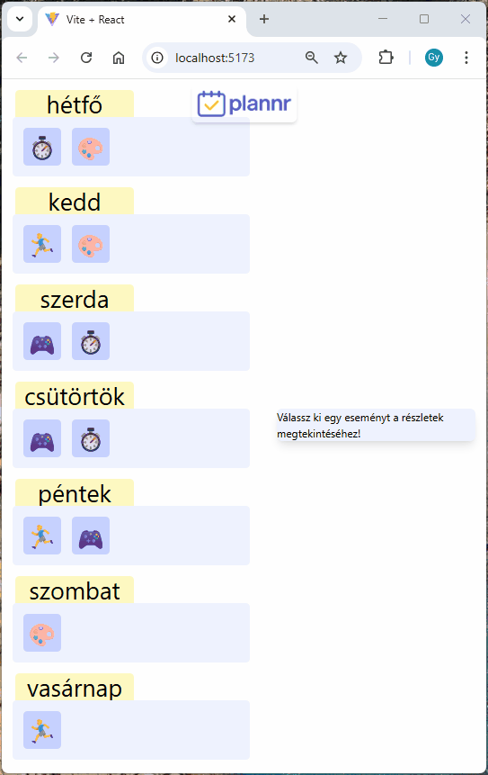
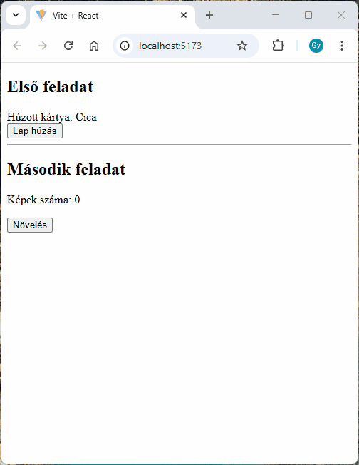
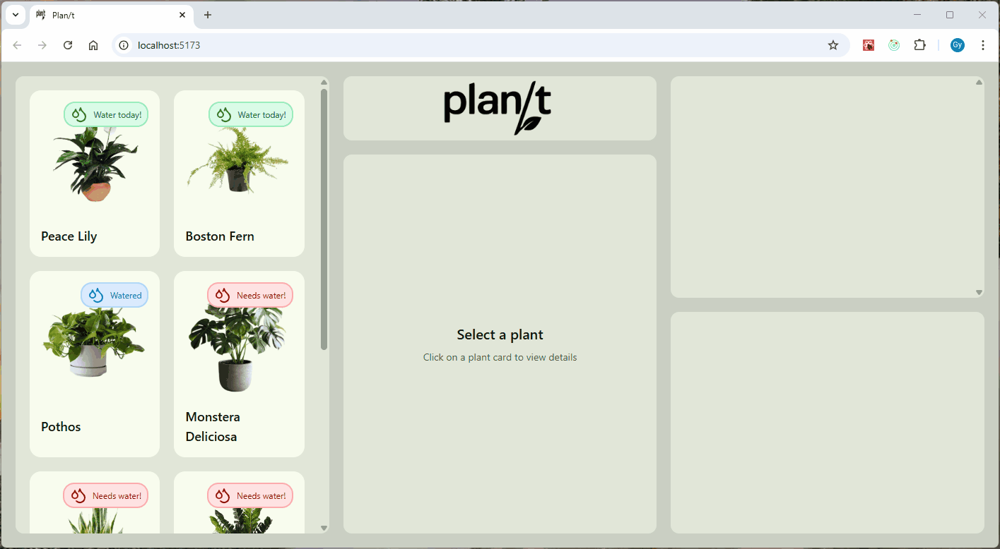
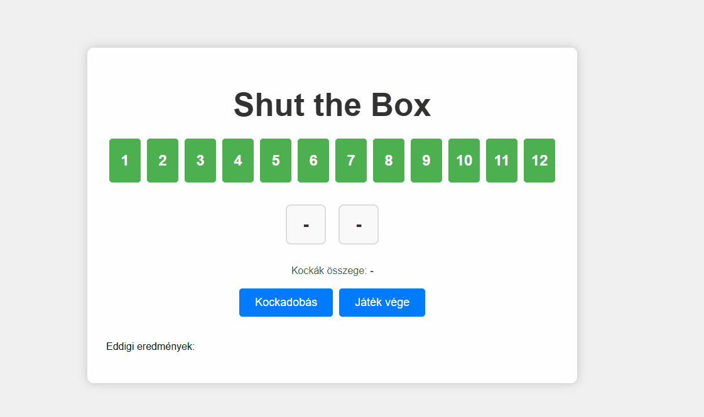

# React pót/javító ZH

_Kliensoldali webprogramozás_

_2025.05.27._

## Tudnivalók

- A zárthelyi megoldására **180 perc** áll rendelkezésre. **További 30 perc**et adunk a `README.md` fájl kitöltésére, a feladatok elolvasására, a szükséges telepítésekre, az anyagok letöltésére, összecsomagolására és feltöltésére.
- A feladatokat a zh rendszeren keresztül kell beadni. **A rendszer a határidő leteltével lezár, ezután nincs lehetőség beadásra.**
- A feladatok megoldásához **az előre feltöltött, illetve elérhető segédanyagok használhatók** (dokumentáció, előadás, órai anyag, cheat sheet). A zh időtartamában igénybe vett **emberi és mesterséges intelligencia segítség tilos** (szinkron, aszinkron, chat, fórum, ChatGPT, Copilot, stb)! Erről nyilatkoztok az alább olvasható `README.md` fájlban is, ahol tudomásul veszitek ennek következményeit.
- A feladatok nem épülnek egymásra, **tetszőleges sorrendben** megoldhatók.

## Előkészületek

1. [Töltsd le a keretprogramot](???)!
2. Az egyes feladatok könyvtárában telepíteni kell a függőségeket egyesével. Ahol `server` és `client` könyvtár van, ott ezt külön meg kell tenni.

   ```sh
   # Telepítés
   cd <feladat_könyvtára>
   npm install

   # Futtatás
   npm run dev
   ```

3. Töltsd ki a `README.md` fájl nyilatkozatában a nevedet és a Neptun azonosítódat! **A megfelelően kitöltött `README.md` fájl nélkül a megoldást nem fogadjuk el!**
4. Ugyanitt megtalálod az egyes feladatok részfeladatainak felsorolását. Ebben az egyes `[ ]` közötti szóközt cseréld le `x`-re azokra a részfeladatokra, amiket sikerült (akár részben) megoldanod! Ez segít nekünk abban, hogy miket kell néznünk az értékeléshez.

## Beadás előtt

1. Ellenőrizd le, hogy a `README.md` fájlt kitöltötted-e!
2. Töröld ki az ÖSSZES `node_modules` könyvtárat!
3. A `react-zh` mappát tömörítsd be és töltsd fel a zh rendszerbe!

## Elérhető dokumentációk

- [React](https://react.dev/)
- [Redux](https://redux.js.org/)
- [Redux toolkit](https://redux-toolkit.js.org/)
- [HTML és JavaScript dokumentáció](https://developer.mozilla.org/en-US/)

## 1. Heti Tervező (1-planner, 10 pont)

Ebben a feladatban egy olyan minimalista heti tervező alkalmazást kell elkészítened, amely segítségével a felhasználók könnyedén áttekinthetik a napi teendőiket egy vizuális heti nézet formájában, és részletes információkat kaphatnak az egyes eseményekről.

A feladat megoldása esetén:

1. A heti listában megjelennek a események a megfelelő napoknál
2. Minden eseménynél a megfelelő kategóriához tartozó emoji jelenik meg
3. Egy feladatra kattintva annak részletei megjelennek a jobb oldali részletező komponensben
4. A részletező komponensben helyesen megjelenik az esemény összes adata

  

A `data/events.json` fájl tartalmazza az események adatait, az alábbi formában:

```json
{
  "id": 1,
  "title": "React tanulás",
  "description": "Komponensek és props megértése React keretrendszerben",
  "category": "Fókusz idő",
  "time": "hétfő/10:00"
}
```

A `data/categoryIcons.ts` fájl tartalmazza a kategóriákhoz tartozó emoji ikonokat:

```javascript
{
  "Fókusz idő": "⏱️",
  "Hobbi": "🎨",
  "Szabadidő": "🎮",
  "Sport": "🏃‍♂️"
}
```

### Feladatok:

- a. (1 pont) Add át add át az események listáját a JSON-ben meghatározott formában az `App.tsx`-ben található `Events` komponensnek propként!
- b. (2 pont) A hét minden napjánál jelenjen meg az összes esemény, amit propertyként átadtunk. Az ikonok lekérdezéséhez vizsgáld meg, majd használd a `getIcon()` függvényt, amelyet a `data/categoryIcons.ts` fájlban találsz!
- c. (3 pont) Egészítsd ki az implementált működést azzal, hogy az adott napnál csak a hozzátartozó események jelenjenek meg!
- d. (2 pont) Hozz létre egy React state-et, amellyel nyomon követheted, hogy melyik esemény van kiválasztva!
  - Az állapotváltozót az `App.tsx` fájlban hozd létre.
  - Az állapotváltozó neve legyen `eventId`.
- e. (2 pont) Érd el az `EventIcon` handleClick propjával, hogy az események ikonjai kattintásra állítsák az `eventId` state-et!

## 2. Hibakeresés (2-mini-tasks, 5 pont)

Keresd meg és javítsd ki a hibát az alábbi két feladatban!



- (2 pont) **Task1**: A Komponensben kártyákat húzunk ki egy pakliból, és felugró ablakban szeretnénk jelezni a felhasználónak, amikor a "Fekete Péter" kártyát húzta. A jelenlegi kód hibás, mivel a "Fekete Péter" kártya felhúzásakor nem jelez, viszont ha utána új kártyát húzunk, akkor tévesen jelez. Javítsd ki úgy, hogy a "Fekete Péter" kártya felhúzásakor jelenjen meg a felhasználónak az alert ablakban az értesítés.

- (3 pont) **Task2**: A komponensben egy gombra kattintva növelni tudjuk a megjelenített képek számát, amelyeket aszinkron módon egy API-tól kapunk meg. A jelenlegi kód hibás, mivel a képek száma ugyan növekszik, a képek viszont nem jelennek meg. Javítsd ki úgy, hogy az új képek mindig jelenjenek meg, amennyiben a képek száma növekszik.

## 3. Plan/t (3-rest-plant, 13 pont)

Készíts egy alkalmazást, amely segít nyilvántartani a szobanövények öntözési időpontjait és emlékeztet, mikor kell őket legközelebb megöntözni.



A szerver alap URL-je http://localhost:3030.

A feladat megoldásához szükséges végpontok a következők:
- `GET /plants`: összes növény adatainak lekérdezése
- `GET /plants/:id/waterings`: egy növény öntözési előzményeinek lekérdezése
- `POST /plants/:id/waterings`: új öntözés rögzítése

```json
{
  "isWatered": true,
  "lastWateredAt": "2023-05-15T10:30:00Z", // new Date(date).toIsoString() -> így kell elküldeni az apinak
  "notes": "Plant looked healthy, soil was quite dry"
}
```

- `DELETE /waterings/:id`: egy öntözés adatainak törlése azonosító alapján

Szerver futtatásához:

- `npm install`
- `npm run dev`: Szerver futtatása (fejlesztői mód)

Feladatok:

- a. (3 pont) A növények lekérése a szerverről megtörténik, és azokat megjelenítjük. (Az adatokat a keretprogram kezdetben JSON fájlból biztosítja. Ezek helyett az adatoknak szerverről kell érkeznie.)
- b. (2 pont) Egy növényre kattintva annak részletes adatai megjelennek a középső panelen.
- c. (2 pont) A kiválasztott növényhez tartozó öntözési előzmények listájának lekérése megtörtént, megtekinthető a megfelelő helyen.
- d. (3 pont) Az öntözési űrlapon kitöltött adatok elküldéskor validálásra kerülnek (kötelező mezők), az öntözés a háttérben rögzítésre kerül a szerveren.
- e. (1 pont) Automatikusan frissül a növények listája és az öntözési előzmények listája.
- f. (2 pont) A "kuka" gombra kattintva lehetőség van az öntözés törlésére a szerverről.

## 4. Shut the Box (4-redux-shut-the-box, 12 pont)

Készíts Redux segítségével egy egyszerűbb "Klip-Klap" alkalmazást!
A játék indulásakor minden szám látható (1-12), majd mindkét kockával dob a játékos. A dobott számokat, vagy azok összegét mutató számokat le kell fordítani/takarni.
A játék célja: hogy a játék végére lehetőség szerint minden számot 0-12-ig letakarni. Egy játékos addig próbálkozhat, amíg le tud fedni számot.
Ha a játékos dobása után nem tud számot lefordítani, a szabadon maradt számokat összeadjuk, és pontszámként annak a játékosnak felírjuk.



Lehetséges állapottér:

```js
{
    selectedNumbers: [],
	flippedNumbers: [],
    dices: [],
    history: [],
}
```

Lehetséges action-ök:

- `ROLL`: kockadobás
- `SELECT`: szám lefordítása
- `END`: játék befejezése

Feladatok:

- a. (2 pont) "Kockadobásra" kattintva küldj egy `ROLL` akciót, mely generál két random számot 1-6 között (dices). A kapott értékek és az összegük kerüljenek megjelenítése a felületen.
- b. (1 pont) Jelenítsd meg 1-12 a lefordítandó számokat (`doboz` stílusosztállyal).
- c. (3 pont) Ha egy számra kattintunk küldj egy `SELECT` akciót, amely megjegyzi az állapottérben az aktuálisan "lefordított" számjegyeket (selectedNumbers).
  Ha azok összege eléri a két dobott szám értékét, akkor ténylegesen lefordítja azokat (flippedNumbers), majd a kockát értékeit is üríti (dices).
  Lehessen aktuálisan lefordított számjegyeket visszafordítani!
- d. (2 pont) A számjegyek állapotuknak megfelelően jelenjen meg. Kapjon `kivalasztva` stílusosztályt, ha mostani körben fog lefordításra kerülni, és `leforditva` stílusosztályt ha már ez előző körökben megtörtént. (ehhez a classnames használható)
- e. (2 pont) "Játék vége" gombra kattintva küldj egy `END` akciót, mely elmenti a felfordítva maradt számok összegét, és visszaállítja az állapottérbe lévő többi változó értékét.
- f. (1 pont) A felületen kerüljenek megjelenítésre az eddigi eredmények.
