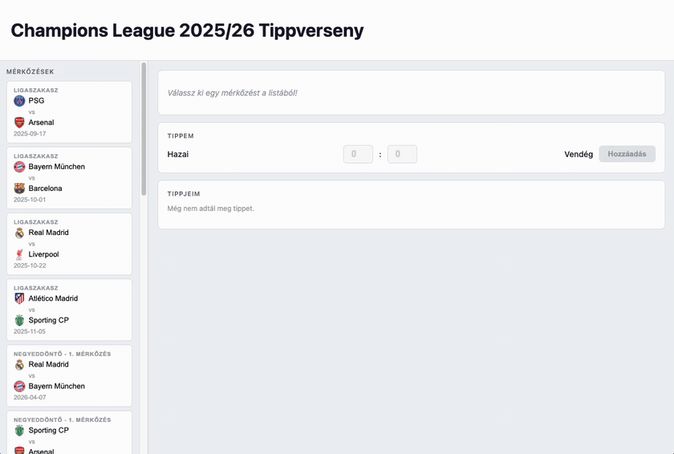
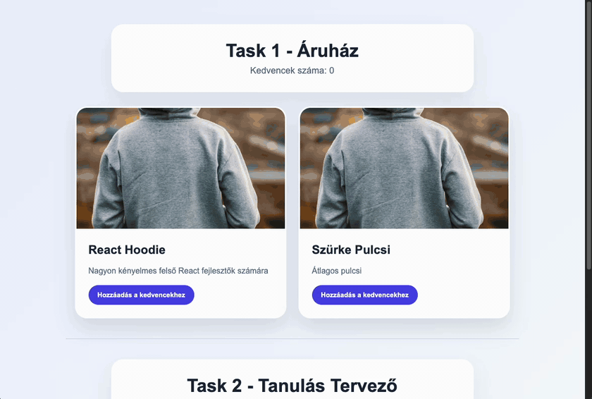
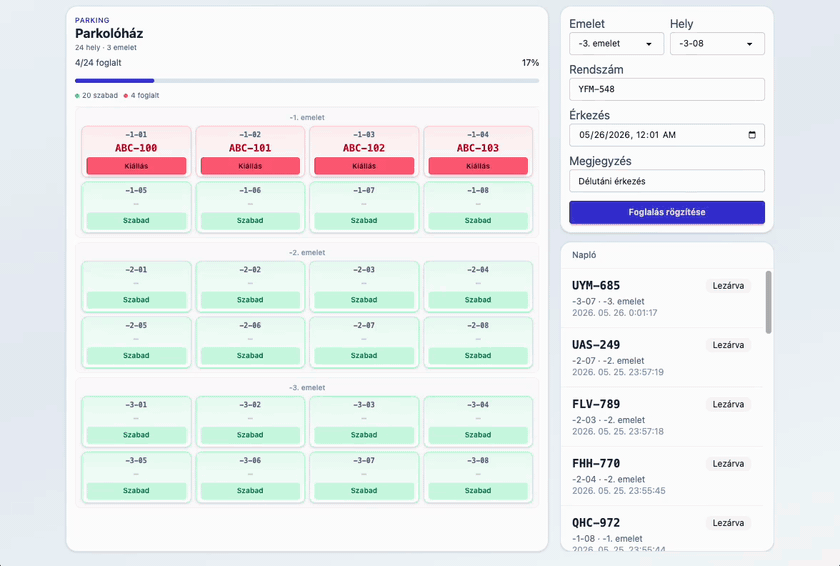
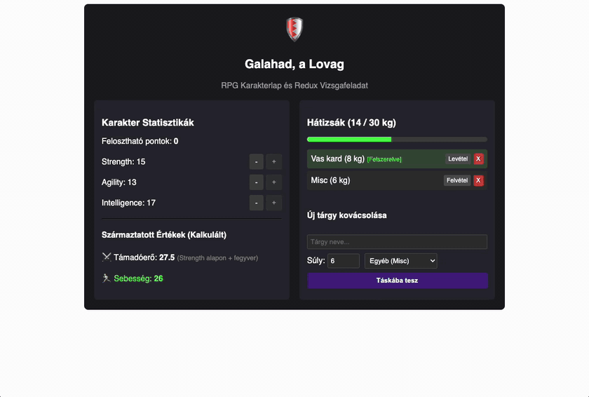

# Kliensoldali webprogramozás évfolyam ZH

**Kezdési időpont**: 2026-05-26 16:20:00
**Határidő**: <span style="color:red">2026-05-26 19:50:00</span>.

## Tudnivalók

- A zárthelyi megoldására **180 perc** áll rendelkezésre. **További 30 percet** adunk a `README.md` fájl kitöltésére, a feladatok elolvasására, a szükséges telepítésekre, az anyagok letöltésére, összecsomagolására és feltöltésére.
- A feladatokat a zh rendszeren keresztül kell beadni. **A rendszer a határidő leteltével lezár, ezután nincs lehetőség beadásra.**
- A feladatok megoldásához **az előre feltöltött, illetve elérhető segédanyagok használhatók** (dokumentáció, előadás, órai anyag, cheat sheet). A zh időtartamában igénybe vett **emberi és mesterséges intelligencia segítség tilos** (szinkron, aszinkron, chat, fórum, ChatGPT, Copilot, stb)! Erről nyilatkoztok az alább olvasható `README.md` fájlban is, ahol tudomásul veszitek ennek következményeit.
- A feladatok nem épülnek egymásra, **tetszőleges sorrendben** megoldhatók.

## Opcionális telepítések

- [PHPComposerInstaller](https://webprogramozas.inf.elte.hu/downloads/PhpComposerInstaller-1.2.7.exe)
- [Live Server](https://webprogramozas.inf.elte.hu/downloads/ritwickdey.liveserver-5.7.10.vsix) (VS Code plugin)
- [PHP Intelephense](https://webprogramozas.inf.elte.hu/downloads/bmewburn.vscode-intelephense-client-1.18.3.vsix) (VS Code plugin)
- [SQLite3 Editor](https://webprogramozas.inf.elte.hu/downloads/yy0931.vscode-sqlite3-editor-1.0.212.vsix) (VS Code plugin)
- [SQLite Explorer](https://webprogramozas.inf.elte.hu/downloads/zknpr.sqlite-explorer-1.3.5.vsix) (VS Code plugin)
- [ESLint](https://webprogramozas.inf.elte.hu/downloads/dbaeumer.vscode-eslint-3.0.24.vsix) (VS Code plugin)
- [Prettier](https://webprogramozas.inf.elte.hu/downloads/esbenp.prettier-vscode-12.4.0.vsix) (VS Code plugin)
- [REST Client](https://webprogramozas.inf.elte.hu/downloads/humao.rest-client-0.25.1.vsix) (VS Code plugin)

<details>
<summary>VS Code pluginok lokális telepítése</summary>


</details>

## Előkészületek

1. Töltsd le a keretprogramot!

2. Az egyes feladatok könyvtárában telepíteni kell a függőségeket egyesével. Ahol `server` és `client` könyvtár van, ott ezt külön meg kell tenni.
    ```bash
    # Példa (3. feladat – parking)
    cd react-zh/3-rest-parking/server && npm install && npm run dev
    cd ../client && npm install && npm run dev

    # Általánosan
    cd <feladat_könyvtára> && npm install && npm run dev
    ```
3. Töltsd ki a `README.md` fájl nyilatkozatában a nevedet és a Neptun azonosítódat! **A megfelelően kitöltött README.md fájl nélkül a megoldást nem fogadjuk el!**

4. Ugyanitt megtalálod az egyes feladatok részfeladatainak felsorolását. Ebben az egyes `[ ]` közötti szóközt cseréld le x-re azokra a részfeladatokra, amiket sikerült (akár részben) megoldanod! Ez segít nekünk abban, hogy miket kell néznünk az értékeléshez.

## Beadás előtt

1. Ellenőrizd le, hogy a `README.md` fájlt kitöltötted-e!
2. Töröld ki az ÖSSZES `node_modules` könyvtárat!
3. A `react-zh` mappát tömörítsd be és töltsd fel a zh rendszerbe!

## Elérhető dokumentációk

- [React](https://react.dev/)
- [Redux](https://redux.js.org/)
- [Redux toolkit](https://redux-toolkit.js.org/)
- [RTK Query](https://redux-toolkit.js.org/rtk-query/overview)
- [TypeScript](https://www.typescriptlang.org/docs/)
- [HTML és JavaScript dokumentáció](https://developer.mozilla.org/en-US/)


[KERETPROGRAM LETÖLTÉSE](???)

## 1. Champions League Tippverseny (1-champions-league, 10 pont)

Ebben a feladatban egy olyan alkalmazást kell elkészítened, amellyel nyomon követheted a Bajnokok Ligája 2025/26-os szezonjának mérkőzéseit, és tippeket adhatsz az eredményekre. 2026. május 30-án a döntőt a PSG és az Arsenal játssza a budapesti Puskás Arénában!

A `data/matchesData.ts` fájl tartalmazza a mérkőzések adatait, az alábbi formában:

```js
interface Team {
  name: string;
  country: string;
  logo: string;
}

interface Match {
  id: number;
  home: Team;
  away: Team;
  date: string;
  venue: string;
  stage: string;
}

interface Prediction {
  matchId: number;
  homeScore: number;
  awayScore: number;
}
```



### Feladatok:
- a. (2 pont) A `MatchList` komponensben jelenleg csak az első mérkőzés jelenik meg. Oldd meg, hogy az összes mérkőzés megjelenjen a `matchesData` tömbből (map, ne felejtsd a `key` prop-ot)!
- b. (2 pont) Kattintással lehessen kiválasztani egy mérkőzést! Kattintáskor tárold el az App komponens állapotterében a kiválasztott mérkőzés azonosítóját (`selectedMatchId`). A kiválasztott mérkőzés kártyája kapja meg a `match-card--selected` CSS osztályt!
- c. (2 pont) Keresd meg a kiválasztott mérkőzést a `matchesData` tömbben, és add át a `MatchDetails` komponensnek! Ha nincs kiválasztott mérkőzés, a komponens jelenítsen meg egy útmutatót (pl. „Válassz ki egy mérkőzést a listából!"). Ha van kiválasztott mérkőzés, jelenjenek meg a csapatok logói, nevei, országa, valamint a mérkőzés szakasza, dátuma és helyszíne!
- d. (4 pont) Valósítsd meg a tippek hozzáadását!
    - Az `App` komponensben hozz létre egy `predictions` állapotváltozót (kezdőértéke üres tömb), és írj egy `addPrediction` függvényt, amely hozzáfűzi az új tippet! (1 pont)
    - A `PredictionForm` komponensben hozz létre helyi állapotváltozókat a hazai és vendég góloknak (`homeScore`, `awayScore`). Kösd össze az input mezőket az állapotváltozókkal (controlled inputs), és az űrlap beküldésekor hívd meg az onAdd propot! Beküldést követően a gólokat tároló állapotokat állítsd vissza 0-ra! (2 pont)
    - A `PredictionList` komponensben jelenítsd meg az összes elmentett tippet! Minden tippnél keresd ki a mérkőzést (`matchId` alapján), és jelenítsd meg a csapatneveket és a tippelt eredményt! (1 pont)

## 2. Hibakeresés (2-mini-tasks, 5 pont)

Keresd meg és javítsd ki a hibát az alábbi két feladatban!



- (2 pont) **Task1**: Jelenleg az áruházban látható kártyák `Hozzáadás a kedvencekhez` gombjára kattintva vizuálisan kedvencnek tudunk jelölni egy terméket, illetve kedvenc termék esetén az `Eltávolítás a kedvencek közül` gombra kattintva meg tudjuk szüntetni a kijelölést. Azonban a `Kedvencek száma` felirat után mindig a kiinduló, 0 érték szerepel. Javítsd ki, hogy megfelelően változzon az érték kártyák kedvencnek jelölése/jelölés megszüntetése esetén.

- (3 pont) **Task2**: A `Task2Component` komponensen belül megjelenítjük az elvégzendő feladatainkat, és a `TaskForm` komponensben van lehetőségünk újabbakat felvenni a listába. Jelenleg azonban hiába írunk be új feladatot, és kattintunk a `Feladat hozzáadása` gombra, a lista nem változik. Javítsd a kódot, hogy hozzáadáskor az új feladat megfelelően eltárolódjon a tömbben, és meg is jelenjen a vizuálisan a listában a többi feladattal együtt.

## 3. Parking (3-rest-parking, 13 pont)

Készíts egy alkalmazást, ahol egy parkolóház parkolóhelyeit tudjuk kezelni. Van egy fastify szerver, ami kezeli a foglalt és a szabad helyeket. A te feladatod, hogy a szerver által kínált API-t használva, egy React alkalmazást készíts, aminek a segítségével meg tudjuk adni a parkolóhelyet és a rendszámot, és kiállást is tudunk végezni a parkolóhelyekről.



**API dokumentáció** (szerver futása után): [http://localhost:3031/docs](http://localhost:3031/docs)
**Hol fut?** | **URL**
|---|---|
**Backend (API)** | `http://localhost:3031` — ezt indítja a `server` mappa (`npm run dev`)
**Frontend (React)** | `http://localhost:5173` — ezt indítja a `client` mappa (`npm run dev`)

A `react-zh/3-rest-parking/server` mappa **kész** — ne módosítsd. A feladat a **client** mappában oldandó meg.

A parkoló **24 helyből** áll, **3 emeleten** (−1, −2, −3). A keretprogramban a **térkép, foglaltsági sáv, foglalás űrlap** és **napló** UI kész — kezdetben a `data/*.json` fájlokból tölt. A domain típusok (`Spot`, `Session`, `ListResponse`, …) megadva.

**API útvonalak** (részletek: `/docs`):
**Végpont** | **Paraméter** | **Jelentés**
|---|---|---|
`GET /spots` | — | Összes hely listája (`ListResponse<Spot>`)
`POST /spots/{id}/sessions` | `{id}` | **`Spot.id`** — foglalás (check-in)
`GET /sessions` | — | Napló (`ListResponse<Session>`)
`PATCH /sessions/{spotId}` | `{spotId}` | **`Spot.id`** — kiállás; a szerver az aktív parkolást zárja le ezen a helyen (**nem** `Session.id`)

### Feladatok:
- a. (4 pont) Kösd be az API-t RTK Query-vel! A helyek a szervertől jöjjenek (`GET /spots`), ne JSON-ból. Az érkező adat típusa: `ListResponse<Spot>`. Kezeld a betöltést és a hibát az `App.tsx`-ben megadott HTML elemek segítségével. Az API-ból betöltve mindhárom emelet, foglalt/szabad állapot és rendszám helyesen jelenjen meg. A `ParkingMap.tsx` `SpotCell` komponensében állítsd be, hogy az occupied változó értéke alapból ne false legyen, hanem `const occupied = spot.status === 'occupied'`
- b. (2 pont) Számold ki, hogy hány foglalt autó van! Az emeletek feletti foglaltsági sáv jelenjen meg megfelelően a foglalt autók száma, és az `OccupancyBar` komponensnek add át a megfelelően kiszámított értéket, és a komponensben a megfelelő módon jelenítsd meg. Jelenítsd meg a foglalt helyek százalékos arányát is a progress HTML elemben.
- c. (2 pont) A **Foglalás rögzítése** gomb küldje el a check-int a szerverre (`POST /spots/{id}/sessions`, mezők: `/docs`). Az űrlap és a validáció elő van készítve neked, csak a beküldést kell megvalósítani. Használd ehhez a `Session` és `CheckInRequest` típusokat. Az `{id}` helyére a számmá alakított `form.place` értéket kell beállítanod, ezzel tudod meghívni a megfelelő API végpontot.
- d. (1 pont) Foglalás után a térkép és a foglaltsági sáv automatikusan frissüljön (RTK Query tag invalidation).
- e. (2 pont) A térképen a **Kiállás** gomb zárja le a parkolást (`PATCH /sessions/{spotId}`, body: `leftAt` — lásd `/docs`) a `SpotCell`-ben (`ParkingMap.tsx`). A `{spotId}` a cella `spot.id` értéke (`CheckOutRequest`).
- f. (1 pont) Az aktivitásnapló a szerverről töltődjön be (`GET /sessions`), és jelenjen meg a `ActivityFeed` komponensben.
- g. (1 pont) Kiállás után is frissüljön a térkép és a foglaltsági sáv automatikusan. Minden kiállási és beállási eseménynél frissüljön a napló is automatikusan.

## 4. RPG (4-rpg, 12 pont)

Készíts Redux segítségével egy egyszerűsített szerepjátékos karakterlapot és hátizsák-menedzsert! A játékos egy rögzített súlykapacitással (30 kg) rendelkezik. A felületen növelheti a karaktere tulajdonságait (erő, ügyesség), fegyvereket vásárolhat a hátizsákjába, és felszerelheti azokat. Ha a hátizsákban lévő tárgyak összsúlya meghalad egy kritikus határt (20 kg), a karakter "túlterhelt" állapotba kerül, ami kihat a statisztikáira.



### Lehetséges állapottér:

```json
{
	attributes: {
		strength: 10,
		agility: 10,
		intelligence: 10,
	},
	attributePointsToDistribute: 15,
	inventory: [
		{ id: '1', name: 'Vas kard', weight: 8, type: 'weapon', equipped: true },
		{ id: '2', name: 'Gyógyital', weight: 1, type: 'potion', equipped: false },
	],
}
```

### Lehetséges action-ök:

- `INCREMENT_ATTRIBUTE`: tulajdonság növelése
- `DECREMENT_ATTRIBUTE`: tulajdonság csökkentése
- `ADD_ITEM_TO_INVENTORY`: új tárgy vásárlása
- `REMOVE_FROM_INVENTORY`: tárgy eldobása/törlése
- `TOGGLE_EQUIP_ITEM`: tárgy felvétele vagy levétele

### Feladatok:

- a. (2 pont) A tulajdonságok (strength, agility, intelligence) mellett lévő + és - gombokra kattintva kezeld a pontelosztást!
    - A + gomb váltson ki egy incrementAttribute akciót, ami növeli a tulajdonságot és csökkenti a szabad pontokat (attributePointsToDistribute). Ha nincs szabad pont, a gombok váljanak letiltottá (disabled).
    - A - gomb váltson ki egy decrementAttribute akciót, ami csökkenti a tulajdonságot és visszaadja a pontot. A gomb legyen letiltva, ha az adott tulajdonság értéke eléri az alap 10-es minimumot.
- b. (2 pont) A „Vásárlás” gombra kattintva küldj egy addItemToInventory akciót, aminek a payloadja a tárgy neve, súlya és típusa. A reducer automatikusan legenerálja az egyedi ID-t és beállítja az equipped: false értéket, ha a súlyhatár engedi.
- c. (2 pont) Jelenítsd meg a hátizsákban (inventory) lévő tárgyakat. Minden tárgy mellett legyen egy „Felszerel / Levesz” (Toggle) és egy „Eldob” gomb.
    - A „Felszerel / Levesz” gomb küldjön egy toggleEquipItem akciót (payload: a tárgy ID-ja). Figyelj rá, hogy a bájital (potion) típusú tárgyaknál ez a gomb ne csináljon semmit (vagy meg se jelenjen)!
    - A „Eldob” gomb küldjön egy removeItemFromInventory akciót, ami végleg törli a tárgyat a hátizsákból.
- d. (2 pont) A hátizsákban lévő tárgyak sora a státuszuknak megfelelően jelenjen meg. Kapjon kivalasztva (vagy felszerelve) stílusosztályt, ha a tárgy equipped: true. Ha a hátizsákban lévő összes tárgy súlya meghaladja a 20 kg-ot, a teljes hátizsák konténere kapjon egy leforditva (vagy tulterhelt) stílusosztályt vizuális figyelmeztetésként.
- e. (2 pont) Számítsd ki és jelenítsd meg a felületen a karakter kalkulált Támadóerejét a következő szabály alapján:
    - Támadóerő: Az erő (strength) tulajdonság értékének a másfélszerese (_strength×1.5_) + minden olyan fegyver (type === 'weapon') bónusza, ami fel van szerelve (equipped: true). Minden felszerelt fegyver adjon fix +5 pontot a támadóerőhöz.
- f. (2 pont) Számítsd ki és jelenítsd meg a felületen a karakter Sebességét a következő szabály alapján:
    - Sebesség: Az ügyesség (agility) tulajdonság kétszerese. Viszont ha a karakter túlterhelt (az inventory-ban lévő tárgyak összsúlya szigorúan nagyobb, mint 20 kg), akkor ez a végső sebesség érték feleződjön meg!

