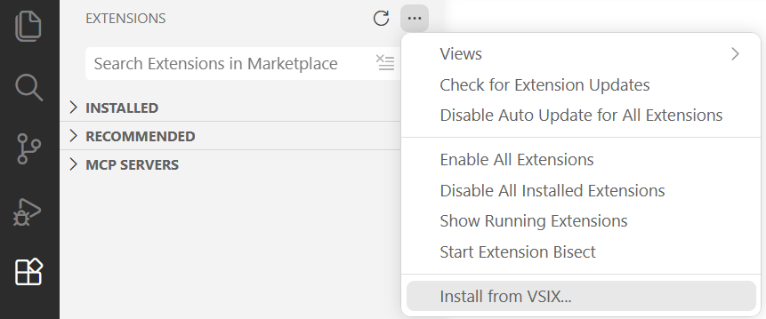
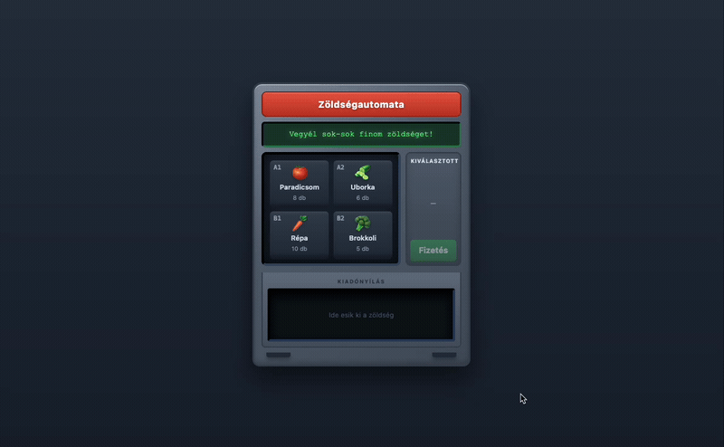
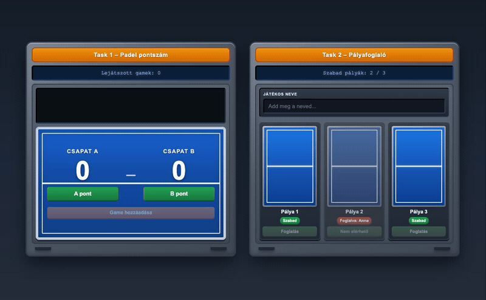
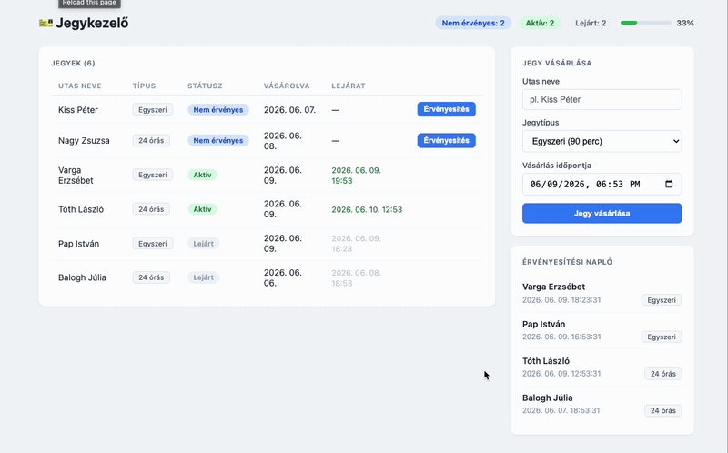
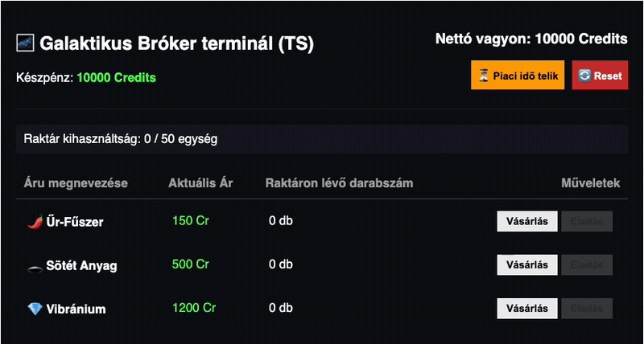

# Kliensoldali webprogramozás évfolyam pót-ZH

**Kezdési időpont**: 2026-06-10 16:00:00
**Határidő**: <span style="color:red">2026-06-10 19:30:00</span>.

## Tudnivalók

- A zárthelyi megoldására **180 perc** áll rendelkezésre. **További 30 perc**et adunk a `README.md` fájl kitöltésére, a feladatok elolvasására, a szükséges telepítésekre, az anyagok letöltésére, összecsomagolására és feltöltésére.
- A feladatokat a zh rendszeren keresztül kell beadni. **A rendszer a határidő leteltével lezár, ezután nincs lehetőség beadásra.**
- A feladatok megoldásához **az előre feltöltött, illetve elérhető segédanyagok használhatók** (dokumentáció, előadás, órai anyag, cheat sheet). A zh időtartamában igénybe vett **emberi és mesterséges intelligencia segítség tilos** (szinkron, aszinkron, chat, fórum, ChatGPT, Copilot, stb)! Erről nyilatkoztok az alább olvasható `README.md` fájlban is, ahol tudomásul veszitek ennek következményeit.
- A feladatok nem épülnek egymásra, **tetszőleges sorrendben** megoldhatók.

## Opcionális telepítések

- [ESLint](https://webprogramozas.inf.elte.hu/downloads/dbaeumer.vscode-eslint-3.0.24.vsix) (VS Code plugin)
- [Prettier](https://webprogramozas.inf.elte.hu/downloads/esbenp.prettier-vscode-12.4.0.vsix) (VS Code plugin)
- [REST Client](https://webprogramozas.inf.elte.hu/downloads/humao.rest-client-0.25.1.vsix) (VS Code plugin)

<details><summary>VS Code pluginok lokális telepítése</summary>



</details>

## Előkészületek

1. Töltsd le a keretprogramot!

2. Az egyes feladatok könyvtárában telepíteni kell a függőségeket egyesével. Ahol `server` és `client` könyvtár van, ott ezt külön meg kell tenni.
    ```bash
    # Példa (3. feladat – jegykezelő)
    cd react-zh/3-rest-bus/server && npm install && npm run dev
    cd ../client && npm install && npm run dev

    # Általánosan
    cd <feladat_könyvtára> && npm install && npm run dev
    ```
3. Töltsd ki a `README.md` fájl nyilatkozatában a nevedet és a Neptun azonosítódat! **A megfelelően kitöltött README.md fájl nélkül a megoldást nem fogadjuk el!**

4. Ugyanitt megtalálod az egyes feladatok részfeladatainak felsorolását. Ebben az egyes [ ] közötti szóközt cseréld le `x`-re azokra a részfeladatokra, amiket sikerült (akár részben) megoldanod! Ez segít nekünk abban, hogy miket kell néznünk az értékeléshez.

## Beadás előtt

1. Ellenőrizd le, hogy a `README.md` fájlt kitöltötted-e!
2. Töröld ki az ÖSSZES `node_modules` könyvtárat!
3. A `react-zh` mappát tömörítsd be és töltsd fel a zh rendszerbe!

## Elérhető dokumentációk

- [React](https://react.dev/)
- [Redux](https://redux.js.org/)
- [Redux Toolkit](https://redux-toolkit.js.org/)
- [RTK Query](https://redux-toolkit.js.org/rtk-query/overview)
- [TypeScript](https://www.typescriptlang.org/)
- [MDN – HTML és JavaScript](https://developer.mozilla.org/)


[KERETPROGRAM LETÖLTÉSE](???)
### 1. Zöldségautomata (1-soda-machine, 10 pont)

Készíts egy zöldségautomatát! A felhasználó kiválaszt egy rekeszt, a jobb oldali panelen látja a kiválasztott zöldséget, majd a **Fizetés** gombra kattintva a gép kiadja a terméket és csökken a készlet.



Az `App.tsx` fájlban találod a termékek kezdeti listáját (`INITIAL_PRODUCTS`). Minden termék az alábbi formában van megadva:

```js
{
  id: "A1",
  name: "Paradicsom",
  emoji: "🍅",
  price: 350,
  stock: 8,
}
```

A `id` mező egyben a rekesz kódja is (pl. „A1”, „B2”).

### Feladatok:
- a. (3 pont) A `ProductGrid.tsx` komponensben jelenítsd meg az **összes** terméket! A kiinduló kódban csak egy rekesz van beégetve, neked meg kell jeleníteni minden a négy zöldséget. Az `App.tsx`-ben van elhelyezve a kiinduló `products` változó, add át a `ProductGrid` komponensnek és listázd ki az elemeket! Add meg a komponensben a beégetett értékek helyett a dinamikus értékeket. Figyelj arra, hogy az onSelect és a classNameben lévő beégetett értékek is legyenek dinamikusak. Ne hagyd le a key paramétert a komponensről!
- b. (2 pont) Az `App.tsx`-ben van elhelyezve a `selectedId` változó. Oldd meg, egy állapotváltozó segítségével, hogy látszódjon, hogy melyik a kiválasztott termék! Add át az állapotváltozó setterét onSelect propként a `ProductGrid` komponensnek, a jelenlegi .
- c. (3 pont) A `products` változót alakítsd át úgy, hogy a készlet frissülésekor frissüljön a `ProductGrid` komponens automatikusan. Fizetéskor (`App.tsx` `pay` függvénye) csökkentsd a készletet eggyel, majd az új készletet tárold a komponens állapotváltozójában.
- d. (1 pont) A `dispensed` változót alakítsd React állapotváltozóvá az `App.tsx`-ben, és add át a `DispenseTray` komponensnek. Fizetéskor állítsd be az értékét a kiadott termékre.
- e. (1 pont) A `DispenseTray.tsx`-ben oldd meg a **feltételes megjelenítést**: ha van kiadott termék (`dispensed`), jelenjen meg az emoji (és opcionálisan a név); különben csak az „Ide esik ki a zöldség” felirat látszódjon.

### 2. Padel hibakeresés (2-padel-mini-tasks, 5 pont)

Keresd meg és javítsd ki a hibát az alábbi két feladatban!



Két padel témájú mini feladat van egymás mellett: **pontszámító** és **pályafoglaló**.

- a. (2 pont) **Task 1 – Padel pontszám**: A pontszám a padel szabályai szerint **0 → 15 → 30 → 40** értékeket vesz fel. A kódban a `PADEL_POINTS = [0, 15, 30, 40]` tömbben tároljuk ezeket az értékeket. Az pointA és pointB változókban tárolt indexek (**0, 1, 2, 3**) segítségével az éppen aktuális pontszámokat tudod kiválasztani. Az **A pont** és **B pont** gombokra kattintva jelenleg nem változik a kijelzett érték. A pontszámítás logikája kész — változatlanul használd, csak javítsd ki a komponensben lévő hibát. A **Game hozzáadása** gombnak akkor kell működnie, ha valamelyik csapat elérte a **40** pontot (ha az index == 3): ilyenkor az aktuális eredmény kerüljön a game listába, majd a pontszámok nullázódjanak.
- b. (3 pont) **Task 2 – Pályafoglaló**: Szabad pályát a játékos nevének megadásával lehet foglalni. Javítsd ki, hogy a `BookingForm`-ban lévő mező a komponens állapotváltozójában folyamatosan tárolja az bemeneti mező értékét, és javítsd ki a `Task2Component`-ben lévő hibás deklarációt. A `handleBook` függvény jelenleg nem frissíti a felületet, ezt is javítsd ki.

### 3. Jegykezelő (3-rest-bus, 13 pont)

Készíts egy tömegközlekedési jegykezelő alkalmazást! Van egy Fastify szerver, ami nyilvántartja a megvásárolt jegyeket és az érvényesítési eseményeket. A te feladatod, hogy a szerver által kínált API-t használva egy React alkalmazást készíts, amellyel új jegyet lehet vásárolni, és a listában meg lehet nyomni az **Érvényesítés** gombot az egyes jegyeknél.


**API dokumentáció** (szerver futása után): **http://localhost:3032/docs**
**Hol fut?** | **URL**
|---|---|
**Backend (API)** | `http://localhost:3032` — ezt indítja a `server` mappa (`npm run dev`)
**Frontend (React)**| `http://localhost:5173` — ezt indítja a `client` mappa (`npm run dev`)

A `react-zh/3-rest-bus/server` mappa **kész** — ne módosítsd. A feladat a **`client`** mappában oldandó meg.

A keretprogramban a **jegylista, statisztikai sáv, vásárlás űrlap** és **érvényesítési napló** UI kész — kezdetben a `data/*.json` fájlokból tölt. A domain típusok megadva (`entities/`: `Ticket`, `Activation`, `ListResponse`, `BuyTicketRequest`, `ActivateRequest`, …).

A szerver háromféle jegytípust ismer, és a `status` / `expiresAt` mezőket mindig dinamikusan számítja:

**Típus** | **Érvényesség**
|---|---|
single | 90 perc
24h | 24 óra
72h | 72 óra

**API útvonalak** (részletek: `/docs`):
**Végpont**	| **Paraméter** | **Jelentés**
|---|---|---|
`GET /tickets`	| —	| Összes jegy; `status` és `expiresAt` dinamikusan számított (`ListResponse<Ticket>`)
`POST /tickets`	| —	| Új jegy vásárlása; body: `{ buyerName, type, purchasedAt }`
`PATCH /tickets/{id}/activate` | {`id`} | **`Ticket.id`** — jegy érvényesítése; body: { `activatedAt` }
`GET /activations` | — | Érvényesítési napló, legutóbbi először (`ListResponse<Activation>`)

Feladatok:

- a. (4 pont) Kösd be az API-t RTK Query-vel! A jegyek a szervertől jöjjenek (`GET /tickets`), ne JSON-ból. Az érkező adat típusa: `ListResponse<Ticket>`. Kezeld a betöltést és a hibát az `App.tsx`-ben megadott HTML elemek segítségével. Hozd létre a Redux store-t, és add hozzá a szükséges middleware-t. Csomagold be az alkalmazást `Provider`-rel a `main.tsx`-ben.
- b. (2 pont) Számold ki, hány jegy van állapotonként! A `TicketStats` komponensnek add át a kiszámított értékeket propként, és a komponensben jelenítsd meg azokat. Jelenítsd meg az aktív jegyek százalékos arányát is a `progress` HTML elemben.
- c. (2 pont) A **Jegy vásárlása** gomb küldje el az adatokat a szerverre RTK Query mutation-nel (`POST /tickets`). A beküldendő body típusa: `BuyTicketRequest` (`entities/forms.ts`: `buyerName`, `type`, `purchasedAt` — ISO string). Az űrlap és a validáció elő van készítve, csak a beküldést kell bekötni. Sikeres vásárlás után az űrlap törlődjön.
- d. (1 pont) Vásárlás után a jegylista automatikusan frissüljön (RTK Query tag invalidation).
- e. (2 pont) A `TicketList.tsx`-ben kösd be az **Érvényesítés** gomb `handleActivate` függvényét: küldd el az érvényesítést a szerverre (`PATCH /tickets/{id}/activate`). A mutation body típusa: `ActivateRequest` (`entities/forms.ts`: `{ activatedAt: string }`). Az activatedAt értékét a gombnyomás pillanatából add meg: `new Date().toISOString()`. Az {`id`} paraméterhez a sor ticket.id értékét használd. (A gomb unused státuszú jegyeknél való megjelenítése a keretprogramban már kész.)
- f. (1 pont) Az érvényesítési napló a szerverről töltődjön be (`GET /activations`), és jelenjen meg az `ActivationFeed` komponensben.
- g. (1 pont) Érvényesítés után is frissüljön a jegylista és a napló automatikusan.

### 4. Galaxy Market (4-galaxy-market, 12 pont)

Készíts Redux segítségével egy sci-fi hangulatú, valós idejű árukereskedő és tőzsdei alkalmazást!
A játékos egy rögzített tőkével (10 000 Credits) és egy maximális raktárkapacitással (MAX_CARGO_CAPACITY = 50 egység) indul.
A felületen különböző űrbéli nyersanyagokat (pl. űr-fűszer, sötét anyag) lehet vásárolni és eladni. Az árak folyamatosan ingadoznak.
Ha a játékos egyetlen árutípusból túl sokat halmoz fel a raktárában (több mint 30 egységet), a portfóliója "monopolizált" (kitett) állapotba kerül, ami extra kockázati díjjal sújtja a tranzakcióit.




Lehetséges állapottér:
```js
{
	credits: 10000,
	cargoCapacityUsed: 0,
	marketPrices: { spice: 150, darkMatter: 500, vibranium: 1200 },
	portfolio: { spice: 0, darkMatter: 0, vibranium: 0 },
}
```

Lehetséges action-ök:

- `BUY_ASSET`: áru vásárlása a tőzsdéről
- `SELL_ASSET`: áru eladása a tőzsdéről
- `RANDOMIZE_PRICES`: az árak piaci ingadozása
- `RESET_MARKET`: a teljes játék alaphelyzetbe állítása

Feladatok:

- a. (2 pont) Készíts egy „Piaci Idő Telik (Áringadozás)” gombot, amelyre kattintva küldj egy randomizePrices akciót.
    Ez módosítsa a marketPrices objektumban lévő árakat egy véletlenszerű értékkel (például -20% és +20% között). Az árak sosem eshetnek 10 Credits alá!
- b. (2 pont) Jelenítsd meg a piacot egy táblázatban, ahol minden nyersanyag mellett van egy „Vásárlás” gomb.
    A gombra kattintva küldj egy buyAsset akciót.A vásárlás csökkentse a játékos credits egyenlegét az aktuális piaci árral, növelje az adott áru mennyiségét a portfolioban, és növelje a cargoCapacityUsed értékét 1-gyel.
    Ha a játékosnak nincs elég pénze, vagy a raktár betelt (cargoCapacityUsed === MAX_CARGO_CAPACITY), a gomb legyen letiltva (disabled), és a Redux se engedje a tranzakciót.
- c. (2 pont) A táblázatban minden áru mellett szerepeljen egy „Eladás” gomb is, ami a sellAsset akciót váltja ki.
    Ez növelje a credits egyenleget az áru aktuális árával, csökkentse a raktárkészletét és a cargoCapacityUsed értékét 1-gyel.
    A gomb legyen letiltva, ha a játékos nem rendelkezik az adott áruból egyetlen darabbal sem.
- d. (2 pont) A felületen jelenítsd meg a játékos portfólióját. Minden nyersanyag sora a státuszának megfelelően változzon.
    Kapjon monopolizalt stílusosztályt az az áru, amiből a játékos már szigorúan több mint 30 egységet birtokol.
    Ha a teljes raktár kihasználtsága eléri a 100%-ot, a raktár konténere kapjon egy leforditva (vagy teli-raktar) stílusosztályt.
- e. (2 pont) Számítsd ki és jelenítsd meg a felületen a játékos Portfólió Nettó Értékét (Net Worth) a következő szabály alapján:
    - Net Worth: Az aktuális credits egyenleg + a portfolio-ban lévő összes áru darabszámának és azok éppen aktuális marketPrices árának szorzata.
- f. (2 pont) Készíts egy „Piac Reset” gombot, ami a resetMarket akciót váltja ki, és állítsa vissza a teljes állapotteret a kiinduló értékekre.
