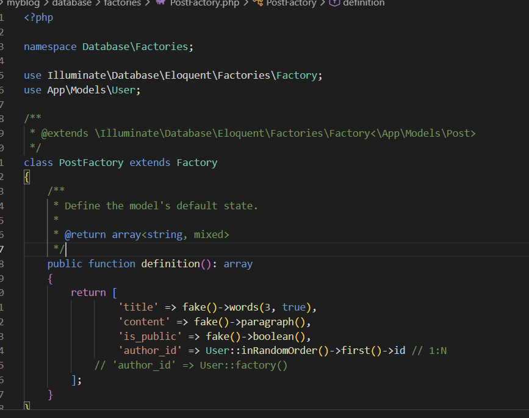
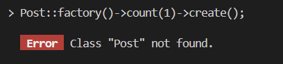
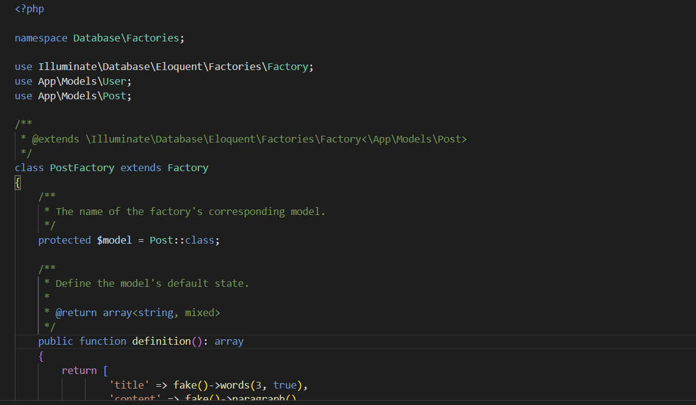

# Laravel Factory és Seeder használat

## Áttekintés

Migrációkkal alakítottuk ki a modellek szerkezetét. A seederekkel lehet az adatbázist szerkeszteni és feltölteni.

## Tinker használata

Laravel Tinker elindítása:

```bash
php artisan tinker
```

## User factory tesztelése

```php
> User::factory(10)->create()
[!] Aliasing 'User' to 'App\Models\User' for this Tinker session.
= Illuminate\Database\Eloquent\Collection {#5912
    all: [
      App\Models\User {#5880
        name: "Greg Kulas",
        email: "peggie.vandervort@example.org",
        email_verified_at: "2026-03-04 14:42:02",
        #password: "$2y$12$8XHlqunPsO.Av9PGWeaRfeoOpPMCmZtlfWezRTQ25HfX0iPh9BruW",
        #remember_token: "LiFBFUSRVo",
        updated_at: "2026-03-04 14:42:02",
        created_at: "2026-03-04 14:42:02",
        id: 12,
      },
      App\Models\User {#5911
        name: "Nakia Lindgren V",
        email: "willard08@example.net",
        email_verified_at: "2026-03-04 14:42:02",
        #password: "$2y$12$8XHlqunPsO.Av9PGWeaRfeoOpPMCmZtlfWezRTQ25HfX0iPh9BruW",
        #remember_token: "bm0klrP8NP",
        updated_at: "2026-03-04 14:42:02",
        created_at: "2026-03-04 14:42:02",
        id: 13,
      },
      App\Models\User {#5884
        name: "Dr. Keely McGlynn",
        email: "hessel.herminia@example.org",
        email_verified_at: "2026-03-04 14:42:02",
        #password: "$2y$12$8XHlqunPsO.Av9PGWeaRfeoOpPMCmZtlfWezRTQ25HfX0iPh9BruW",
        #remember_token: "TsFzScrVS8",
        updated_at: "2026-03-04 14:42:02",
        created_at: "2026-03-04 14:42:02",
        id: 14,
      },
      App\Models\User {#5879
        name: "Misael Wuckert II",
        email: "marlene16@example.com",
        email_verified_at: "2026-03-04 14:42:02",
        #password: "$2y$12$8XHlqunPsO.Av9PGWeaRfeoOpPMCmZtlfWezRTQ25HfX0iPh9BruW",
        #remember_token: "6hKeY3KOaa",
        updated_at: "2026-03-04 14:42:02",
        created_at: "2026-03-04 14:42:02",
        id: 15,
      },
      App\Models\User {#5878
        name: "Madilyn Reilly",
        email: "beahan.xavier@example.net",
        email_verified_at: "2026-03-04 14:42:02",
        #password: "$2y$12$8XHlqunPsO.Av9PGWeaRfeoOpPMCmZtlfWezRTQ25HfX0iPh9BruW",
        #remember_token: "cIPGv5j3Xj",
        updated_at: "2026-03-04 14:42:02",
        created_at: "2026-03-04 14:42:02",
        id: 16,
      },
      App\Models\User {#5877
        name: "Valentina Connelly",
        email: "maverick.pfannerstill@example.net",
        email_verified_at: "2026-03-04 14:42:02",
        #password: "$2y$12$8XHlqunPsO.Av9PGWeaRfeoOpPMCmZtlfWezRTQ25HfX0iPh9BruW",
        #remember_token: "2ElmPlChP5",
        updated_at: "2026-03-04 14:42:02",
        created_at: "2026-03-04 14:42:02",
        id: 17,
      },
      App\Models\User {#5876
        name: "Dr. Brayan Schumm",
        email: "oscar63@example.org",
        email_verified_at: "2026-03-04 14:42:02",
        #password: "$2y$12$8XHlqunPsO.Av9PGWeaRfeoOpPMCmZtlfWezRTQ25HfX0iPh9BruW",
        #remember_token: "QDPk6m7QyW",
        updated_at: "2026-03-04 14:42:02",
        created_at: "2026-03-04 14:42:02",
        id: 18,
      },
      App\Models\User {#5875
        name: "Miss Jaunita Bayer MD",
        email: "hane.jimmie@example.org",
        email_verified_at: "2026-03-04 14:42:02",
        #password: "$2y$12$8XHlqunPsO.Av9PGWeaRfeoOpPMCmZtlfWezRTQ25HfX0iPh9BruW",
        #remember_token: "TSamPoEHWr",
        updated_at: "2026-03-04 14:42:02",
        created_at: "2026-03-04 14:42:02",
        id: 19,
      },
      App\Models\User {#5874
        name: "Hassie Crooks",
        email: "esteban01@example.com",
        email_verified_at: "2026-03-04 14:42:02",
        #password: "$2y$12$8XHlqunPsO.Av9PGWeaRfeoOpPMCmZtlfWezRTQ25HfX0iPh9BruW",
        #remember_token: "OwGzrCxJHk",
        updated_at: "2026-03-04 14:42:02",
        created_at: "2026-03-04 14:42:02",
        id: 20,
      },
      App\Models\User {#5873
        name: "Herman Mante",
        email: "connelly.shyanne@example.net",
        email_verified_at: "2026-03-04 14:42:02",
        #password: "$2y$12$8XHlqunPsO.Av9PGWeaRfeoOpPMCmZtlfWezRTQ25HfX0iPh9BruW",
        #remember_token: "2Oglom4ijE",
        updated_at: "2026-03-04 14:42:02",
        created_at: "2026-03-04 14:42:02",
        id: 21,
      },
    ],
  }
```

## Post factory hiba és megoldás

### Előtte (hibás)



### Hiba



```php
> Post::factory()->count(1)->create()

   Error  Class "Post" not found.
```

### A hiba oka és megoldása

A probléma a `PostFactory.php` fájlban volt:

1. **Hiányzó import:** A fájlból hiányzott a `use App\Models\Post;` sor
2. **Megoldás lépései:**
   - `Ctrl+C` - kilépés az Artisan Tinker-ből
   - `composer dump-autoload` - autoload cache frissítése
   - Tinker újraindítása

### PostFactory.php javítás

```php
<?php

namespace Database\Factories;

use Illuminate\Database\Eloquent\Factories\Factory;
use App\Models\User;
use App\Models\Post; // ez hiányzott!

class PostFactory extends Factory
{
    protected $model = Post::class; // ez is kellett!
    
    // ... többi kód
}
```

Ezek után a `Post::factory()->count(1)->create()` parancs sikeresen működik.

### Utána (javított)


